# PsyML Toolkit

<p align="center">
  <a href="#chinese">中文</a> · <a href="#english">English</a> · <a href="#french">Français</a>
</p>

<a id="chinese"></a>

## 中文

PsyML Toolkit 是面向研究者的本地机器学习工具。它把数据检查、变量角色、预处理、模型比较、参数选择、验证、结果解释和可复现性材料放进同一流程。Godot 图形界面采用“场景定义固定布局、脚本处理动态状态”的混合结构；训练和评价由 `src/psyml/` 中同一套 Python 核心完成。输入数据只在本机处理。

当前支持分类与回归、23 个按任务划分的模型选项、9 种表格格式、6 种验证策略、多模型与多验证比较、训练集内部参数搜索、动态剩余时间、长任务终止，以及预测、图形、Methods 说明和复现报告导出。界面支持中文、英文和法文。

### 工作流程总览

1. **导入数据**：读取本地表格，核对字段类型和缺失值。
2. **定义研究问题**：选择任务、目标变量、预测变量，以及重复测量所需的分组变量。
3. **定义分析设计**：选择缺失值处理和缩放；这些步骤只在训练数据上拟合。
4. **选择验证策略**：先选主要验证，再按需增加敏感性分析；第一项决定最终模型选择。
5. **选择候选模型**：可同时比较多个模型，不需要逐个重跑。
6. **选择参数策略**：使用默认参数、内置快速搜索，或输入自定义候选值。
7. **检查并运行**：运行前查看完整配置和任务规模；运行时查看当前工作和预计剩余时间，也可终止。
8. **解释与导出**：先看每种验证内的排行榜，再查看逐折结果、预测、风险提示和复现文件。

### 安装与启动

需要 Python 3.10–3.12、[uv](https://docs.astral.sh/uv/) 和 [Godot 4.7.2](https://godotengine.org/download/archive/4.7.2-stable/)。在仓库根目录运行：

```bash
uv sync --locked --group dev
uv run python tools/launch_gui.py
```

也可使用命令行：`uv run psyml --help`。若 Godot 不在系统路径中，请将 `PSYML_GODOT` 设为 Godot 可执行文件的完整路径。

### GUI 详细操作

#### 1. 数据与变量

点击“浏览…”，支持 CSV、TSV、XLSX、XLS、SPSS SAV、Stata DTA、SAS7BDAT、XPT 和 Parquet。选择文件后会自动读取预览；直接编辑路径时点击“读取预览”。预览后：

- 核对行数、列数、变量类型和缺失值数量；
- 在预览表中确认分隔、表头和字符编码没有被误读；
- 勾选实际进入模型的预测变量；
- 不要把参与者编号、答案键、采集时间戳等仅用于识别或管理的字段当成预测变量；
- 目标变量和分组变量会自动从预测变量中排除。

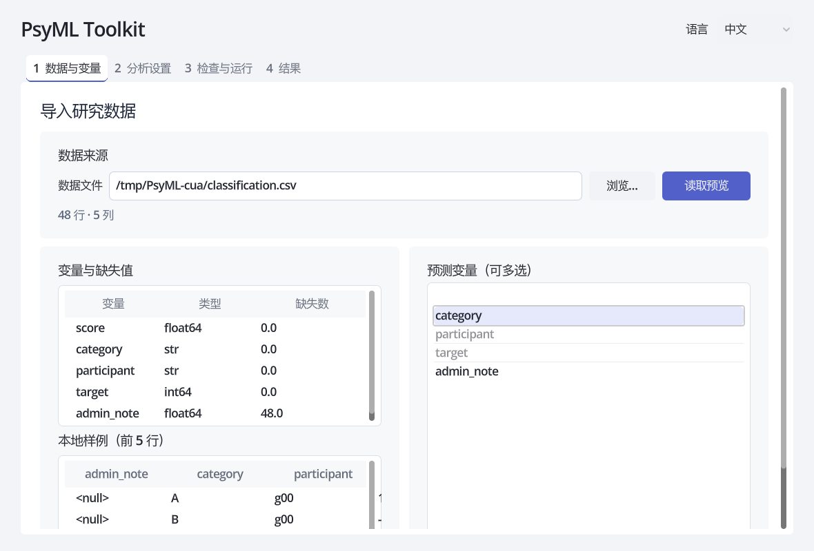

#### 2. 任务、目标与分组

- **分类**：目标是类别，例如诊断组别、是否复发或实验条件，至少需要两个类别。
- **回归**：目标是连续数值，例如量表总分、反应时或生理测量。
- **分组变量**：同一参与者、家庭、学校、中心或批次出现多行时必须设置。它确保同一组不会同时进入训练和测试。

重复测量却不设置分组变量会造成信息泄漏，使结果显得不真实地好。分组变量本身不会作为预测变量。

#### 3. 预处理

- **缺失值**：删除缺失行，或用均值、中位数、众数填补。均值/中位数适合数值字段，众数也可处理类别字段。
- **缩放**：标准化、Min-Max 或不缩放。SVM、KNN、正则线性模型和神经网络通常对缩放敏感；树模型通常不依赖缩放。
- 类别变量由核心自动编码。编码、填补和缩放都封装在训练流水线内，只从当前训练折学习，避免提前使用测试折信息。

#### 4. 验证策略：可多选，但第一项是主要验证

按研究设计预先选择验证，不能看结果再挑最高分。多选时，列表最靠前的已选项是**主要验证**，决定主指标和样本外预测；其余为敏感性分析。每个外层训练分区独立在内层选择家族与参数，最终全数据家族也只由全数据内层选择确定，外层排行榜不参与选择。

| 策略 | 适用情形 | 关键限制 |
| --- | --- | --- |
| 留出法 | 较大、独立同分布的数据；快速初查 | 单次切分波动较大 |
| K 折 | 一般回归或类别较均衡的独立样本 | 同一参与者不能有多行 |
| 分层 K 折 | 分类且类别比例需要在各折中尽量保持 | 不隔离重复参与者 |
| 分组 K 折 | 存在参与者、中心或批次分组 | 类别比例可能不均衡 |
| 分层分组 K 折 | 分类、存在分组，同时希望尽量保持类别比例 | 需要足够多且分布合理的组 |
| 留一组法 | 逐个检验中心、参与者或批次的外推 | 组数多时运行很慢 |

“折数”控制 K 折类策略。每个类别或独立组必须足以支持所选折数。当前版本没有专门的时间序列切分；有时间顺序的数据不应直接使用随机 K 折。

#### 5. 候选模型：可多选

分类模型包括 KNN、随机森林、SVM、MLP、决策树、逻辑回归、朴素贝叶斯、LDA、QDA、梯度提升、堆叠和 Dummy 基线。回归模型包括 KNN、Lasso、MLP、随机森林、SVR、线性回归、Ridge、Elastic Net、决策树、梯度提升和 Dummy 基线。

建议至少保留一个可解释的简单模型和一个 Dummy 基线。复杂模型胜出并不自动意味着研究结论更可靠；还要检查差值、波动、样本规模和外部有效性。

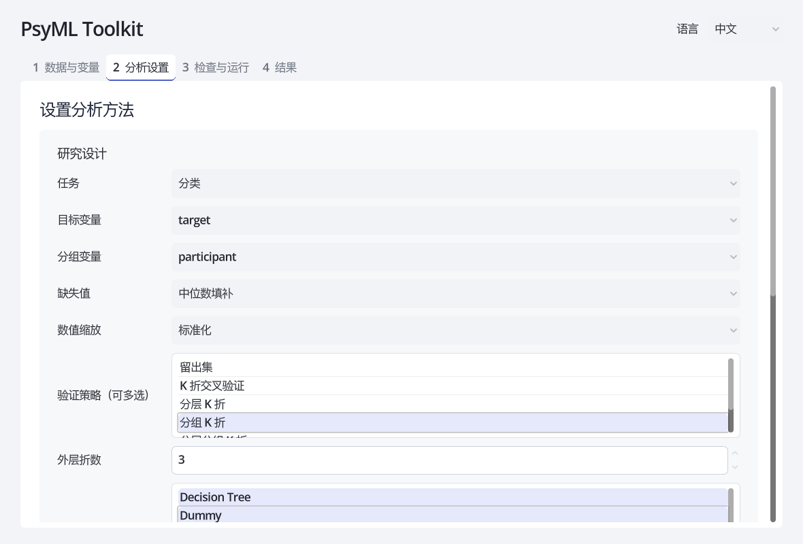

#### 6. 参数与选择指标

PsyML 不把任何默认参数称为“最优”。最优参数依赖数据、目标和验证设计。

- **不搜索**：直接使用模型默认参数，速度最快，适合流程检查或预先规定的分析。
- **快速搜索**：使用界面显示的有界候选网格。例如随机森林比较树数、深度和最小叶节点样本数；SVM/SVR 比较 `C`、核函数及回归的 `epsilon`；正则线性模型比较正则强度。它是合理起点，不是通用最优解。
- **自定义搜索**：勾选参数并把候选值写成 JSON 数组，例如 `[0.1, 1.0, 10.0]`、`[null, 5, 10]` 或 `["linear", "rbf"]`。运行前的配置预览会显示解析后的值。

“每模型最多候选数”限制组合爆炸；超过上限时用固定种子抽样。内层同时选择模型家族与超参数，外部测试折不参与选择。即使“不搜索参数”，选多个家族仍需要内层验证。最后在全部分析数据上重新进行家族与参数选择并拟合。主指标评价完整选择流程，不是最终拟合模型的独立测试成绩。

选择指标：

- 分类默认**平衡准确率**，适合类别不平衡；也可选宏平均 F1 或准确率。
- 回归默认 **RMSE**，较强调大误差；也可选 MAE 或 R²。
- 指标应在分析前根据研究目标确定，不建议看完结果后反复更换指标。

#### 7. 检查、运行、观察与终止

进入“检查与运行”后：

1. 选择新建或空结果目录；程序拒绝覆盖非空目录，已有输出会保留；
2. 核对输入路径、变量、主要验证顺序、模型、参数网格、指标、随机种子和任务数量；
3. 点击运行；界面持续显示当前阶段、模型、验证和外部折，以及已完成/剩余任务和动态预计时间；
4. 预计时间根据已完成任务更新，模型耗时差异较大时会波动；它是估计，不是承诺；
5. 如任务过长，点击“终止运行”。后台分析进程会停止，未完成的结果不应作为有效研究输出；调整候选数、模型或验证后可重新运行。

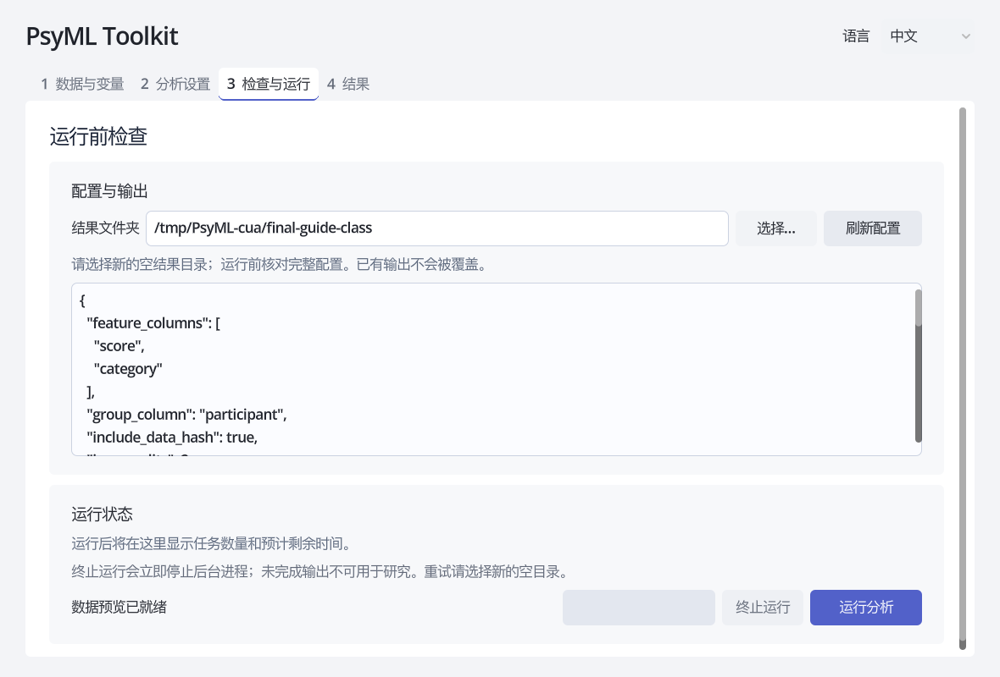

#### 8. 结果与解释

结果页分别显示最终全数据拟合的家族/参数、完整选择流程的主要验证指标与图形，以及探索性家族排行榜。排行榜在每种验证内从 1 排名；排行榜第一名可以与最终拟合家族不同。不同验证不能按最高分选择研究结论。

建议依次检查：

1. 风险提示是否指出类别过少、组数不足、缺失行删除或非分组验证；
2. 最佳模型相对 Dummy 和简单模型的提升是否有实际意义；
3. `metrics_summary.csv` 中各折均值和标准差，避免只看平均值；
4. `predictions.csv` 中的系统性错误和异常样本；
5. 分类任务的混淆矩阵，或回归任务的误差图；
6. 敏感性验证下模型排序是否稳定；
7. Methods 与复现报告是否准确描述最终分析。

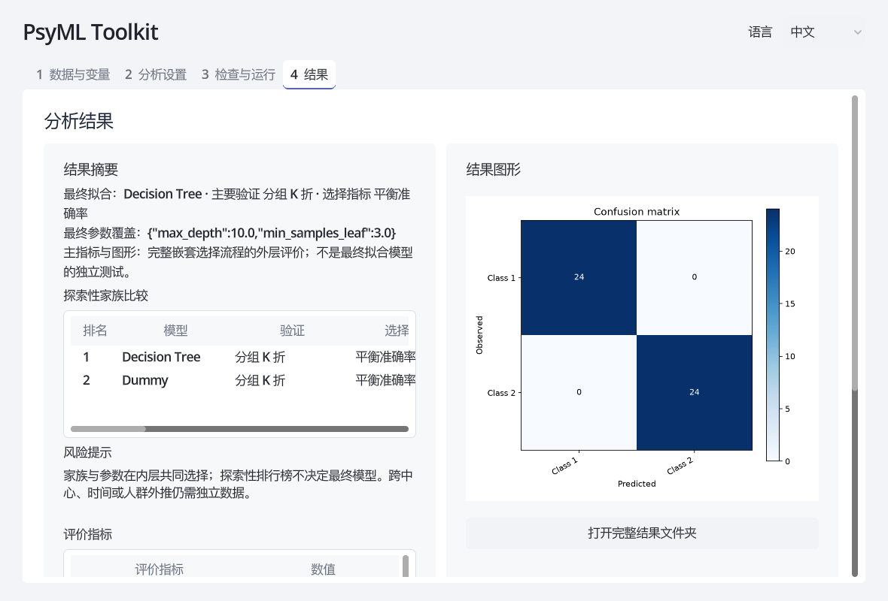

### 输出文件

| 文件 | 内容 |
| --- | --- |
| `result.json` | GUI 摘要、最终家族/参数、主要验证及 evaluation_scope |
| `model_comparison.csv` | 每个模型—验证组合的状态、排名和指标 |
| `parameter_search.csv` | 各外部训练折及最终全数据调参中，所有候选的内部验证成绩与失败信息 |
| `best_parameters.json` | 最终选中模型在全部分析数据上再搜索得到的参数覆盖；单候选时使用该候选 |
| `study_config.json` | 完整比较设计，包括全部候选模型与验证 |
| `analysis_config.json` / `config.json` | 实际执行并可用于重跑的配置 |
| `metrics.csv` | 主要验证下完整选择流程的外层汇总指标；单家族时评价该家族 |
| `fold_metrics.csv` / `metrics_summary.csv` | 逐折指标与跨折汇总 |
| `predictions.csv` | 样本索引、外部折、观测值与预测值 |
| `confusion_matrix.csv` | 分类任务的混淆矩阵 |
| `warnings.json` | 方法和数据风险提示 |
| `methods_summary.md` / `reproducibility_report.md` | 用于核对论文方法与复现环境的说明 |

### 本轮审查与人工验收

- [中文 GUI 人工测试指南：15分钟主流程 + 15–20分钟边界测试](docs/GUI_MANUAL_TEST_ZH.md)
- [科学正确性专项审查、修复证据与人工决策](docs/audit-2026-09-05/SCIENTIFIC_REVIEW.md)
- [视觉变化与四页前后截图](docs/audit-2026-09-05/VISUAL_REVIEW.md)

当前使用 `selection_protocol="nested_family_v1"`：家族和参数共同在内层选择，主结果来自外层对该完整流程的评价。探索性家族排行榜的获胜分数仍不能当成选择后的独立估计。`selection_trace.csv` 记录逐折与最终的家族选择；`validation_summary.csv` 区分主要与敏感性评价。三份配置保留原始设计，最终覆盖参数单独保存；复跑用新的空目录。旧版配置未注明此字段时按新流程执行，**不声称与旧版外层选家族的数值结果相同**。详见[方法选择依据与实施](docs/audit-2026-09-05/NESTED_SELECTION.md)。

### 方法边界、隐私与许可

家族与参数选择采用完整嵌套设计，预处理只在训练数据上拟合；这能减少常见的测试集泄漏和选择偏差，但不能替代独立外部验证、样本量论证、领域判断或研究者对最终结论的责任。设计依据包括 scikit-learn 关于[数据泄漏](https://scikit-learn.org/stable/common_pitfalls.html)、[嵌套交叉验证](https://scikit-learn.org/stable/auto_examples/model_selection/plot_nested_cross_validation_iris.html)、[参数搜索](https://scikit-learn.org/stable/modules/grid_search.html)及[分组交叉验证](https://scikit-learn.org/stable/modules/cross_validation.html)的指南，以及 [TRIPOD+AI 报告规范](https://www.bmj.com/content/385/bmj-2023-078378)。

仓库截图和测试夹具使用随机合成数据，不包含参与者信息。公开示例采用 UCI 的 [Iris](https://doi.org/10.24432/C56C76) 和[混凝土抗压强度](https://doi.org/10.24432/C5PK67)数据；运行方法见[公开示例说明](examples/public/README.md)。请勿在 GitHub Issue 中上传真实研究数据或敏感信息。

除另行标注的第三方内容外，项目代码与文档采用 [Apache License 2.0](LICENSE)，允许使用、修改和分发，并包含明确的专利授权。第三方依赖与数据仍遵循各自许可证。

### 开发与参与

机器学习核心由项目作者编写；Godot GUI 在 AI 协助下开发。作者参与了项目设计、功能与隐私边界制定、代码审查和完整测试，并继续对项目发布与研究使用承担责任。这里所说的 AI 协助不改变作者对已有代码的权属，也不替代人工审查。

欢迎研究者通过 GitHub Issue 反馈可复现的问题、方法建议和使用体验。请使用仓库中的随机合成测试数据或能够公开分享的最小示例，切勿上传真实参与者数据、未公开研究资料、访问凭据或其他敏感内容。

<a id="english"></a>

## English

PsyML Toolkit is a local machine-learning tool for researchers. It joins data review, variable roles, preprocessing, model comparison, parameter selection, validation, interpretation and reproducibility outputs in one workflow. The Godot GUI uses a hybrid structure in which scenes define the fixed layout and scripts manage dynamic state; the Python core in `src/psyml/` performs training and evaluation. Input data stay on the local computer.

It supports classification and regression, 23 task-specific model choices, 9 tabular formats, 6 validation strategies, multi-model and multi-validation studies, training-only parameter search, dynamic time estimates, cancellation of long jobs, predictions, figures, Methods text and reproducibility reports. The GUI is available in Chinese, English and French.

### Workflow at a glance

1. Import and inspect a local dataset.
2. Define the task, outcome, predictors and any repeated-observation group.
3. Choose missing-value handling and scaling.
4. Select the primary validation first, then optional sensitivity validations.
5. Select one or more candidate models.
6. Use default parameters, the bounded quick search, or a custom value grid.
7. Review the design and workload, run it, monitor progress and stop it if necessary.
8. Interpret within-validation rankings, fold variability, predictions, warnings and exported evidence.

### Install and launch

Install Python 3.10–3.12, [uv](https://docs.astral.sh/uv/) and [Godot 4.7.2](https://godotengine.org/download/archive/4.7.2-stable/), then run from the repository root:

```bash
uv sync --locked --group dev
uv run python tools/launch_gui.py
```

For the command line, run `uv run psyml --help`. If Godot is not on `PATH`, set `PSYML_GODOT` to its full executable path.

### Detailed GUI guide

#### 1. Data and variables

Choose a CSV, TSV, XLSX, XLS, SPSS SAV, Stata DTA, SAS7BDAT, XPT or Parquet file and load its preview. Check dimensions, inferred types, missing counts, headers and character handling. Select only genuine predictors. Administrative IDs, answer keys and acquisition timestamps should not normally become predictors. The outcome and group fields are automatically excluded.

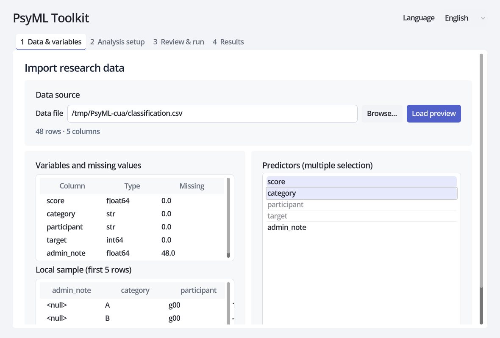

#### 2. Task, outcome and groups

Use classification for categorical outcomes and regression for continuous outcomes. Set a group column whenever participants, families, sites, schools or batches contribute multiple rows. A group-aware split prevents the same group from appearing in training and testing. The group column is not used as a predictor.

#### 3. Preprocessing

Missing rows can be dropped or values imputed with the mean, median or mode. Scaling can be standard, min-max or disabled. Scaling is commonly important for SVM, KNN, regularized linear models and neural networks, and less important for trees. Encoding, imputation and scaling are fitted inside each training fold, not on the held-out fold.

#### 4. Validation: multiple selections, one primary design

Prespecify validation from the research design. The first selected strategy supplies the primary metrics and out-of-sample predictions; other strategies are sensitivity analyses. Family and parameter selection occur within each outer training partition. Final full-data selection also uses inner CV, never the outer family leaderboard.

| Strategy | Typical use | Main limitation |
| --- | --- | --- |
| Holdout | Large independent dataset or quick check | High split-to-split variation |
| K-fold | General regression or balanced independent samples | Does not isolate repeated participants |
| Stratified K-fold | Classification where class proportions matter | Does not isolate groups |
| Group K-fold | Participants, sites or batches must be isolated | Class balance may vary |
| Stratified group K-fold | Grouped classification requiring approximate class balance | Requires enough suitably distributed groups |
| Leave-one-group-out | Direct generalization to each site, participant or batch | Can be very slow with many groups |

The fold count applies to K-fold strategies. Each class or independent group must support the requested count. This release has no dedicated time-series splitter; ordered data should not use random K-fold without a justified design.

#### 5. Candidate models

Classification provides KNN, random forest, SVM, MLP, decision tree, logistic regression, Gaussian naive Bayes, LDA, QDA, gradient boosting, stacking and Dummy. Regression provides KNN, Lasso, MLP, random forest, SVR, linear regression, Ridge, Elastic Net, decision tree, gradient boosting and Dummy.

Select several models in one run. Retaining an interpretable simple model and a Dummy baseline makes the comparison more informative. A complex winner is not automatically a stronger scientific conclusion.

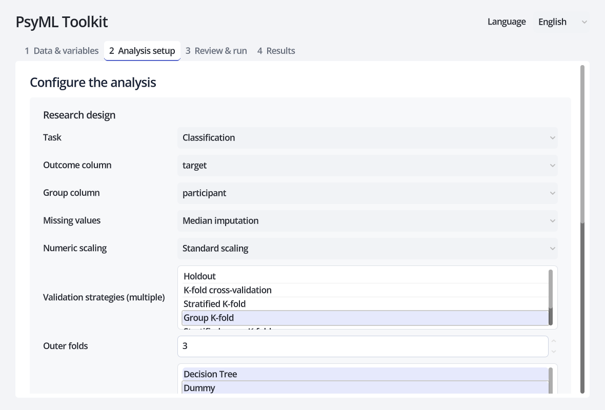

#### 6. Parameters and selection metric

PsyML does not claim that default parameters are optimal: optimality depends on the data, outcome and validation design.

- **No search** uses estimator defaults and suits workflow checks or prespecified analyses.
- **Quick search** uses the bounded grids displayed in the GUI. They cover influential parameters such as forest size/depth, SVM `C` and kernel, regularization strength, neighbors, learning rate and leaf size. They are starting points, not universal optima.
- **Custom search** accepts JSON arrays such as `[0.1, 1.0, 10.0]`, `[null, 5, 10]` or `["linear", "rbf"]`. Enable only the parameters to explore and confirm the parsed grid in the review tab.

The candidate cap controls combinatorial growth through reproducible sampling. Inner folds jointly select families and parameters; even “No parameter search” needs inner selection when multiple families are selected. Each outer test fold evaluates the selected procedure without participating in its choice. Final family and parameters are reselected on all analyzed data before fitting.

Classification offers balanced accuracy (default), macro F1 and accuracy. Regression offers RMSE (default), MAE and R². Choose the metric from the research objective before examining results.

#### 7. Review, run, monitor and stop

Choose a fresh output directory, then verify paths, roles, primary-validation order, models, grids, metric, seed and displayed workload. During the run, the GUI reports the phase, current model, validation and outer fold, completed and remaining tasks, and a dynamic ETA. ETA changes as the observed cost of models changes. “Stop run” terminates the analysis process; incomplete outputs should not be treated as research results. Reduce models, candidates or validations and rerun when needed.

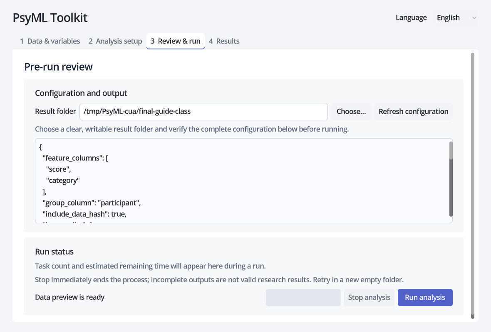

#### 8. Results and interpretation

The result tab distinguishes the final fitted family/parameters, primary outer evaluation of the complete selection procedure, and an exploratory per-family leaderboard. The top-ranked exploratory family need not be the final family. Ranks restart within each validation; scores across validation designs are not one pooled competition.

Check warnings first, improvement over Dummy and simple models, fold-level variability, systematic prediction errors, the classification confusion matrix or regression error plot, and whether sensitivity validations tell a consistent story. Finally, verify the generated Methods and reproducibility reports.

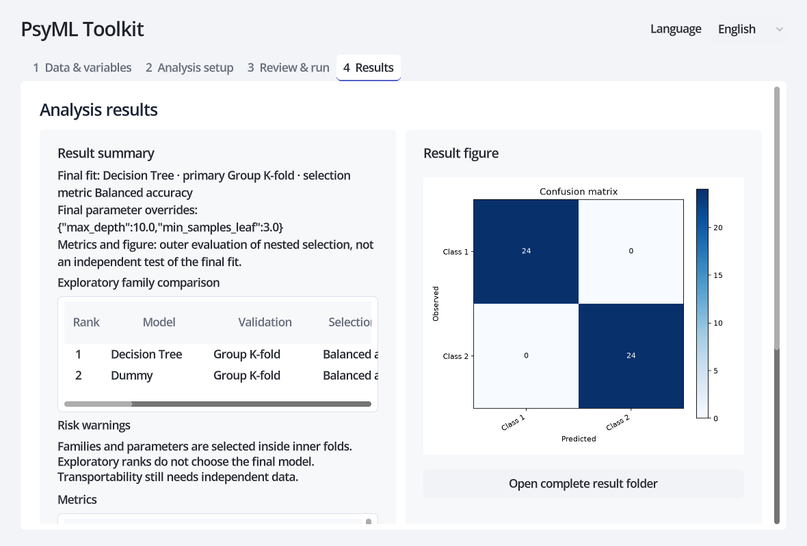

### Output files

`result.json` is the GUI summary. `model_comparison.csv` contains all model–validation rankings; `parameter_search.csv` contains inner-search evidence; `best_parameters.json` and `study_config.json` record the chosen parameters and full design. `metrics.csv`, `fold_metrics.csv`, `metrics_summary.csv`, `predictions.csv` and `confusion_matrix.csv` provide evaluation details. `warnings.json`, `methods_summary.md` and `reproducibility_report.md` support review and reporting. Saved configuration files preserve the original search design; rerun into a new or empty output directory. Final parameters are saved separately. Family and parameter selection are jointly nested (`selection_protocol=nested_family_v1`). `selection_trace.csv` records fold/final choices; `validation_summary.csv` separates primary and sensitivity results. Legacy configurations without the protocol field use the new procedure; old numerical results are not guaranteed to match. Exploratory leaderboard winning scores remain subject to selection bias.

### Methodological scope, privacy and license

Nested family/parameter selection and training-only preprocessing reduce common leakage and selection bias, but they do not replace external validation, sample-size reasoning, domain judgment or researcher responsibility. The design follows scikit-learn guidance on [data leakage](https://scikit-learn.org/stable/common_pitfalls.html), [nested cross-validation](https://scikit-learn.org/stable/auto_examples/model_selection/plot_nested_cross_validation_iris.html), [parameter search](https://scikit-learn.org/stable/modules/grid_search.html) and [group-aware cross-validation](https://scikit-learn.org/stable/modules/cross_validation.html), alongside the [TRIPOD+AI reporting guidance](https://www.bmj.com/content/385/bmj-2023-078378).

Screenshots and test fixtures use random synthetic data. Public examples use UCI’s [Iris](https://doi.org/10.24432/C56C76) and [Concrete Compressive Strength](https://doi.org/10.24432/C5PK67) datasets; see the [public example instructions](examples/public/README.md). Never attach real research data or sensitive participant information to a GitHub Issue.

Except for separately identified third-party material, the project is licensed under the [Apache License 2.0](LICENSE), permitting use, modification and distribution and including an express patent grant. Dependencies and datasets retain their own licenses.

### Development and participation

The machine-learning core was written by the project author; the Godot GUI was developed with AI assistance. The author participated in project design, definition of functional and privacy boundaries, code review and complete testing, and remains responsible for the project’s release and research use. AI assistance does not change ownership of the existing code or replace human review.

Researchers are welcome to report reproducible problems, methodological suggestions and usability feedback through GitHub Issues. Use the repository’s random synthetic fixture or a minimal example that can be shared publicly; never upload real participant data, unpublished research material, credentials or other sensitive information.

<a id="french"></a>

## Français

PsyML Toolkit est un outil local d’apprentissage automatique destiné à la recherche. Il réunit l’examen des données, les rôles des variables, le prétraitement, la comparaison des modèles, le choix des paramètres, la validation, l’interprétation et les éléments de reproductibilité. L’interface Godot suit une structure hybride : les scènes définissent la mise en page fixe et les scripts gèrent l’état dynamique ; le noyau Python de `src/psyml/` réalise l’entraînement et l’évaluation. Les données restent sur l’ordinateur local.

Il prend en charge la classification et la régression, 23 choix de modèles selon la tâche, 9 formats tabulaires, 6 stratégies de validation, plusieurs modèles et validations par étude, la recherche de paramètres dans les données d’entraînement, l’estimation dynamique du temps restant, l’arrêt des tâches longues, ainsi que les prédictions, figures, méthodes et rapports de reproductibilité. L’interface existe en chinois, anglais et français.

### Vue d’ensemble du parcours

1. Importer et examiner un jeu de données local.
2. Définir la tâche, la cible, les prédicteurs et l’éventuel groupe d’observations répétées.
3. Choisir le traitement des valeurs manquantes et la mise à l’échelle.
4. Sélectionner d’abord la validation principale, puis les analyses de sensibilité.
5. Sélectionner un ou plusieurs modèles candidats.
6. Utiliser les paramètres par défaut, la recherche rapide bornée ou une grille personnalisée.
7. Vérifier la conception et la charge, lancer, suivre la progression et arrêter si nécessaire.
8. Interpréter les classements par validation, la variabilité entre plis, les prédictions et les avertissements.

### Installation et lancement

Installez Python 3.10–3.12, [uv](https://docs.astral.sh/uv/) et [Godot 4.7.2](https://godotengine.org/download/archive/4.7.2-stable/), puis lancez depuis la racine du dépôt :

```bash
uv sync --locked --group dev
uv run python tools/launch_gui.py
```

Pour la ligne de commande, utilisez `uv run psyml --help`. Si Godot n’est pas dans le `PATH`, définissez `PSYML_GODOT` avec le chemin complet de l’exécutable.

### Guide détaillé de l’interface

#### 1. Données et variables

Choisissez un fichier CSV, TSV, XLSX, XLS, SPSS SAV, Stata DTA, SAS7BDAT, XPT ou Parquet, puis chargez l’aperçu. Vérifiez les dimensions, les types, les valeurs manquantes, les en-têtes et les caractères. Ne retenez que de vrais prédicteurs : les identifiants administratifs, clés de réponse et horodatages ne devraient généralement pas l’être. La cible et le groupe sont automatiquement exclus.

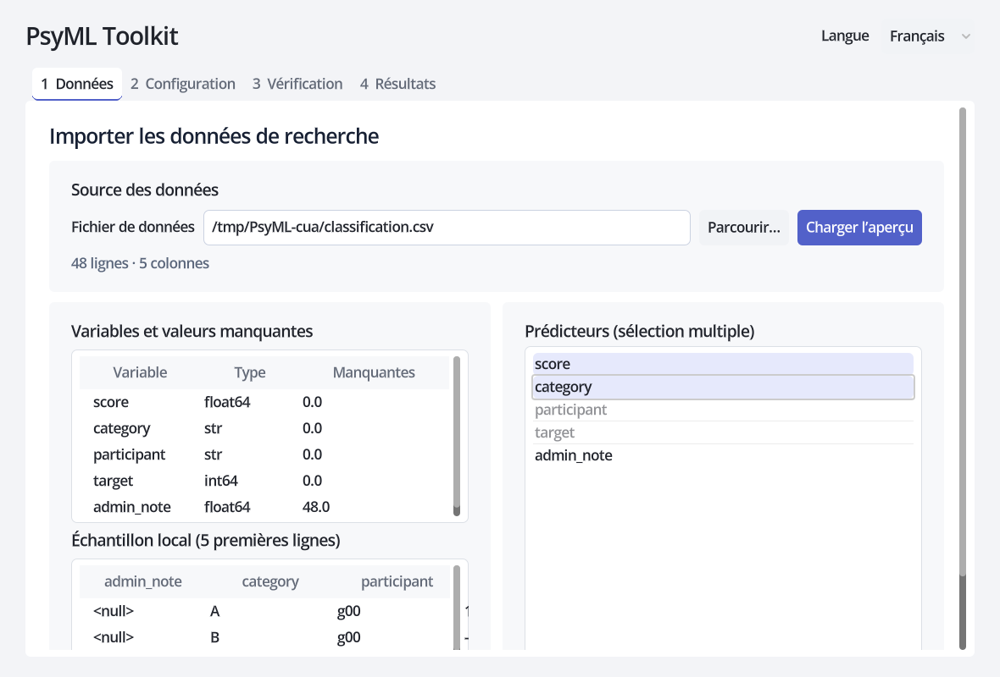

#### 2. Tâche, cible et groupes

La classification convient à une cible catégorielle ; la régression à une cible continue. Définissez un groupe lorsque plusieurs lignes appartiennent à la même personne, famille, école, centre ou lot. Une séparation par groupes empêche qu’un même groupe se retrouve dans l’entraînement et le test. Le groupe n’est jamais un prédicteur.

#### 3. Prétraitement

Les lignes manquantes peuvent être supprimées, ou les valeurs imputées par moyenne, médiane ou mode. La mise à l’échelle peut être standard, min-max ou désactivée. Elle est souvent importante pour SVM, KNN, les modèles linéaires régularisés et les réseaux de neurones, et moins pour les arbres. Encodage, imputation et mise à l’échelle sont ajustés uniquement sur chaque pli d’entraînement.

#### 4. Validation : plusieurs choix, une conception principale

Prédéfinissez la validation selon le plan de recherche. La première stratégie fournit les métriques principales et les prédictions hors entraînement ; les autres sont des analyses de sensibilité. Le choix des familles et paramètres se fait dans les partitions internes, jamais à partir du classement externe.

| Stratégie | Usage typique | Limite principale |
| --- | --- | --- |
| Séparation simple | Grand échantillon indépendant ou vérification rapide | Forte variabilité d’une séparation à l’autre |
| K plis | Régression générale ou échantillons indépendants équilibrés | N’isole pas les participants répétés |
| K plis stratifiés | Classification où les proportions de classes comptent | N’isole pas les groupes |
| K plis par groupes | Participants, centres ou lots à isoler | Équilibre des classes variable |
| K plis stratifiés par groupes | Classification groupée avec équilibre approximatif des classes | Exige assez de groupes bien distribués |
| Un groupe laissé de côté | Généralisation à chaque site, personne ou lot | Peut être très lent |

Le nombre de plis concerne les stratégies K plis. Chaque classe ou groupe indépendant doit être assez représenté. Cette version n’a pas de séparation temporelle dédiée : des données ordonnées ne doivent pas utiliser des K plis aléatoires sans justification.

#### 5. Modèles candidats

La classification propose KNN, forêt aléatoire, SVM, MLP, arbre de décision, régression logistique, Bayes gaussien, LDA, QDA, gradient boosting, stacking et Dummy. La régression propose KNN, Lasso, MLP, forêt aléatoire, SVR, régression linéaire, Ridge, Elastic Net, arbre, gradient boosting et Dummy.

Plusieurs modèles peuvent être comparés en une seule exécution. Conserver un modèle simple interprétable et une référence Dummy rend la comparaison plus utile. Un modèle complexe gagnant ne garantit pas à lui seul une conclusion scientifique plus solide.

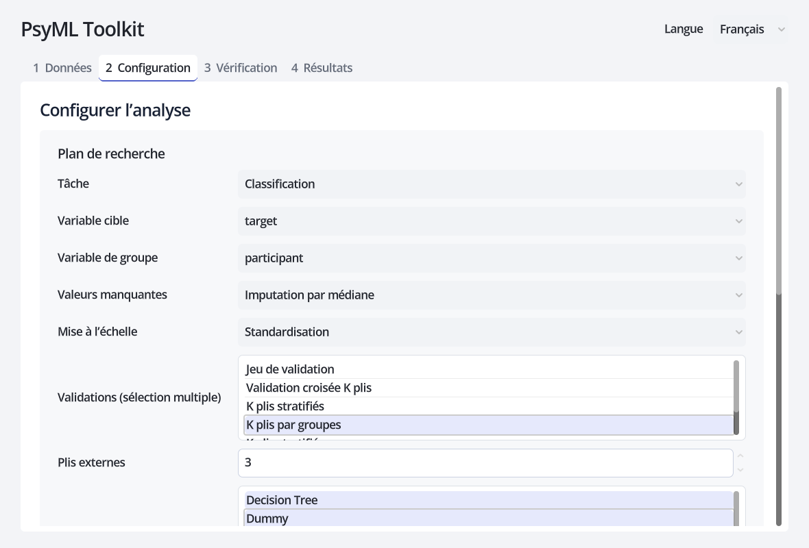

#### 6. Paramètres et métrique de sélection

PsyML ne présente aucun paramètre par défaut comme optimal : l’optimalité dépend des données, de la cible et du plan de validation.

- **Sans recherche** : paramètres par défaut, rapide pour vérifier le parcours ou exécuter une analyse prédéfinie.
- **Recherche rapide** : grilles bornées affichées par l’interface, couvrant notamment taille/profondeur des forêts, `C` et noyau des SVM, régularisation, voisins, apprentissage et taille des feuilles. Ce sont des points de départ.
- **Recherche personnalisée** : tableaux JSON tels que `[0.1, 1.0, 10.0]`, `[null, 5, 10]` ou `["linear", "rbf"]`. Activez les paramètres utiles et vérifiez la grille interprétée avant l’exécution.

La limite de candidats contrôle le coût par échantillonnage reproductible. Les plis internes sélectionnent conjointement familles et paramètres, même sans recherche de paramètres si plusieurs familles sont choisies. Chaque pli externe évalue la procédure sélectionnée. Famille et paramètres finaux sont ensuite resélectionnés sur toutes les données par validation interne.

Pour la classification : exactitude équilibrée par défaut, F1 macro ou exactitude. Pour la régression : RMSE par défaut, MAE ou R². La métrique doit être décidée selon l’objectif avant d’examiner les résultats.

#### 7. Vérifier, lancer, suivre et arrêter

Choisissez un nouveau dossier de résultats et vérifiez les chemins, rôles, ordre des validations, modèles, grilles, métrique, graine et charge annoncée. Pendant l’analyse, l’interface montre la phase, le modèle, la validation, le pli externe, les tâches terminées et restantes, ainsi qu’un temps estimé dynamique. L’estimation varie selon le coût réel des modèles. « Arrêter » termine le processus ; des sorties incomplètes ne doivent pas être utilisées comme résultats. Réduisez modèles, candidats ou validations puis relancez si nécessaire.


#### 8. Résultats et interprétation

Les résultats distinguent la famille et les paramètres ajustés sur toutes les données, l’évaluation principale de la procédure complète et un classement exploratoire par famille. La première famille du classement peut différer du modèle final. Les rangs recommencent dans chaque validation.

Examinez d’abord les avertissements, puis le gain par rapport aux modèles Dummy et simples, la variabilité entre plis, les erreurs systématiques, la matrice de confusion ou le graphique des erreurs, et la stabilité entre validations de sensibilité. Vérifiez enfin les fichiers Methods et de reproductibilité.

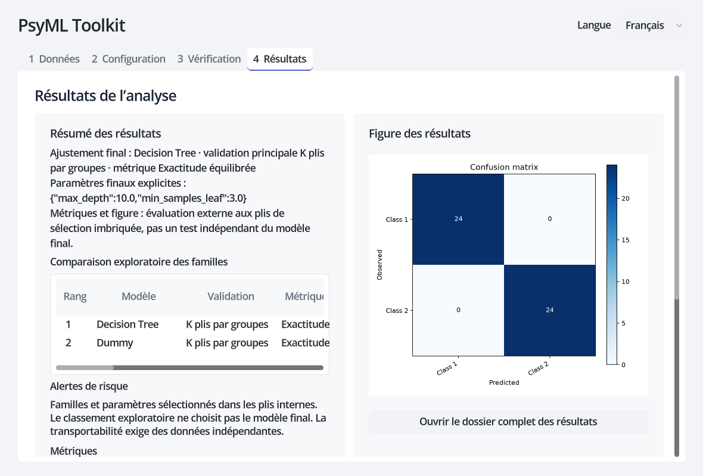

### Fichiers produits

`result.json` contient le résumé de l’interface. `model_comparison.csv` contient tous les classements modèle–validation ; `parameter_search.csv` documente la recherche interne ; `best_parameters.json` et `study_config.json` conservent les paramètres retenus et la conception complète. `metrics.csv`, `fold_metrics.csv`, `metrics_summary.csv`, `predictions.csv` et `confusion_matrix.csv` détaillent l’évaluation. `warnings.json`, `methods_summary.md` et `reproducibility_report.md` facilitent l’examen et la rédaction. Les configurations enregistrées conservent le plan initial ; utilisez un dossier de sortie nouveau ou vide pour relancer. Les paramètres finaux sont enregistrés séparément. Familles et paramètres sont sélectionnés conjointement dans les plis internes (`nested_family_v1`). `selection_trace.csv` documente les choix et `validation_summary.csv` distingue les validations. Les anciennes configurations sans ce champ utilisent désormais la nouvelle procédure ; leurs anciens résultats numériques ne sont pas garantis identiques. Le score gagnant du classement exploratoire reste sujet au biais de sélection.

### Portée méthodologique, confidentialité et licence

La sélection imbriquée des familles/paramètres et le prétraitement limité à l’entraînement réduisent les fuites et biais de sélection courants. Ils ne remplacent ni validation externe, ni raisonnement sur la taille d’échantillon, ni expertise du domaine, ni responsabilité du chercheur. La conception suit les recommandations scikit-learn sur les [fuites de données](https://scikit-learn.org/stable/common_pitfalls.html), la [validation imbriquée](https://scikit-learn.org/stable/auto_examples/model_selection/plot_nested_cross_validation_iris.html), la [recherche de paramètres](https://scikit-learn.org/stable/modules/grid_search.html) et la [validation par groupes](https://scikit-learn.org/stable/modules/cross_validation.html), ainsi que [TRIPOD+AI](https://www.bmj.com/content/385/bmj-2023-078378).

Les captures et jeux de test sont synthétiques et aléatoires. Les exemples publics utilisent [Iris](https://doi.org/10.24432/C56C76) et [Concrete Compressive Strength](https://doi.org/10.24432/C5PK67) d’UCI ; voir les [instructions](examples/public/README.md). Ne joignez jamais de données de recherche réelles ou sensibles à une issue GitHub.

Sauf éléments tiers signalés séparément, le projet est sous [licence Apache 2.0](LICENSE), qui autorise l’utilisation, la modification et la distribution et inclut une concession explicite de brevets. Les dépendances et données conservent leurs propres licences.

### Développement et participation

Le noyau d’apprentissage automatique a été écrit par l’auteur du projet ; l’interface Godot a été développée avec l’aide de l’IA. L’auteur a participé à la conception du projet, à la définition des limites fonctionnelles et de confidentialité, à la revue du code et aux tests complets, et reste responsable de la publication du projet et de son usage en recherche. L’aide de l’IA ne modifie pas la propriété du code existant et ne remplace pas la revue humaine.

Les chercheurs sont invités à signaler, via les issues GitHub, les problèmes reproductibles, suggestions méthodologiques et retours d’utilisation. Utilisez le jeu synthétique aléatoire du dépôt ou un exemple minimal publiable ; ne téléversez jamais de données réelles de participants, de documents de recherche non publiés, d’identifiants d’accès ou d’autres informations sensibles.
