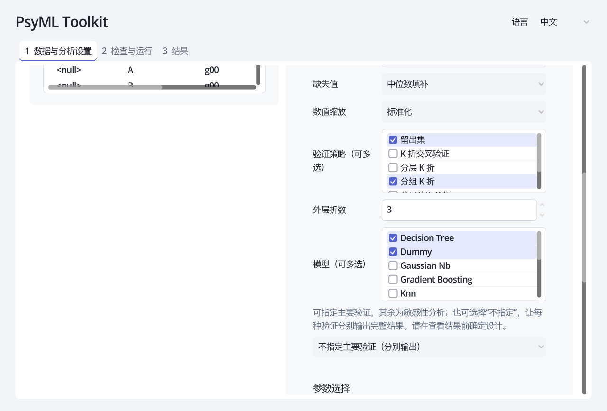
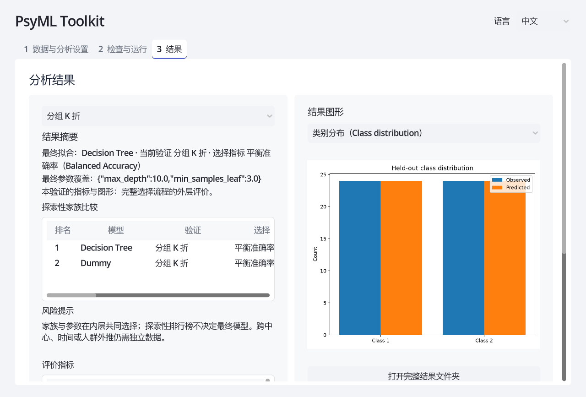
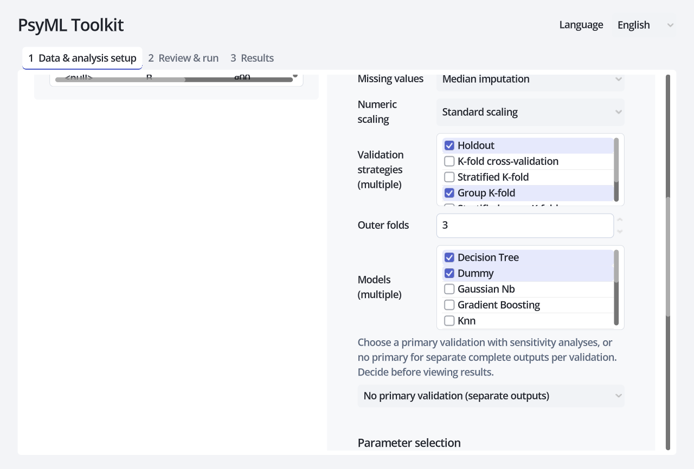
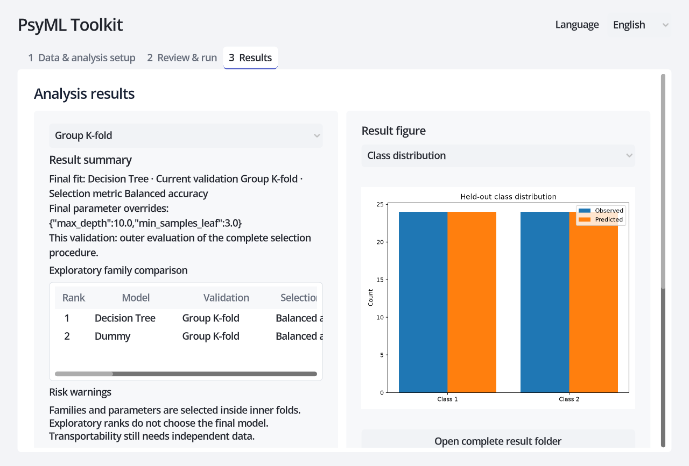
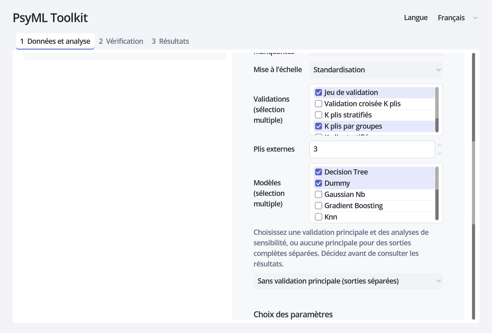
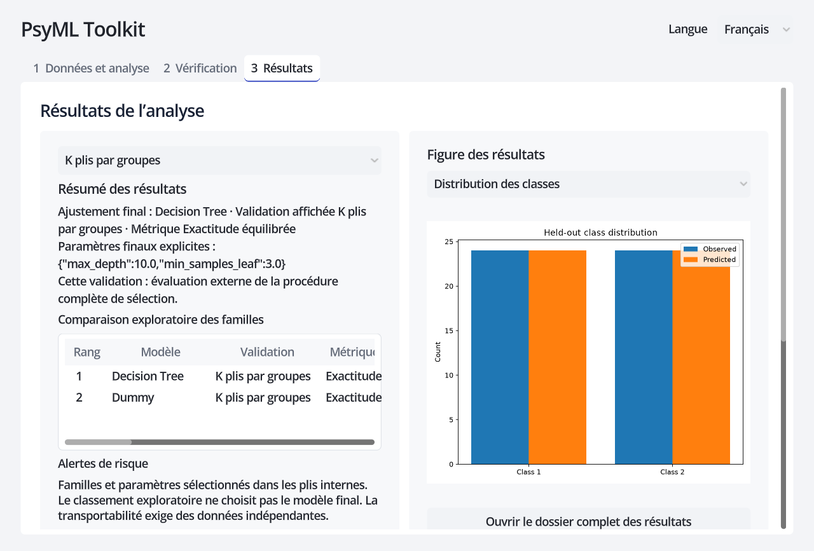

# PsyML Toolkit

**v0.1.0** · [Releases](https://github.com/GuGuGu-coocoo/PsyMl_Toolkit/releases) · [Tests / 测试 / Tests](docs/TESTING.md)

<p align="center">
  <a href="#chinese">中文</a> · <a href="#english">English</a> · <a href="#french">Français</a>
</p>

<a id="chinese"></a>

## 中文

📖 [研究者参考：模型、指标、结果与术语](docs/RESEARCHER_GUIDE_ZH.md) — 中文术语附英文名称，包含简短公式、阅读示例与解释边界。其他版本：[English](docs/RESEARCHER_GUIDE_EN.md) · [Français](docs/RESEARCHER_GUIDE_FR.md)

PsyML Toolkit 是面向研究者的本地机器学习工具。它把数据检查、变量角色、预处理、模型比较、参数选择、验证、结果解释和可复现性材料放进同一流程。Godot 图形界面与命令行共用同一套 Python 分析核心。输入数据只在本机处理。

当前支持分类与回归、23 个按任务划分的模型选项、9 种表格格式、6 种验证策略、多模型与多验证比较、训练集内部参数搜索、动态剩余时间、长任务终止，以及预测、图形、Methods 说明和复现报告导出。界面支持中文、英文和法文。


界面截图由 v0.1.0 当前三页布局生成，每种语言对应自己的截图。模型名称和配置键保留英文；中文常用指标显示中文加英文名称或缩写。导出的科学图形轴、类别占位标签与底层错误原文使用英文，界面语言切换不会重绘这些 PNG。自动报告提供中文和英文，暂不生成法文报告。

### 测试数据与快速复现入口

无需在线下载：点击界面顶部 **“测试数据”** 可直接打开内置样例目录。

- [分类数据](examples/synthetic/classification.csv) · [分类配置](examples/synthetic/classification_config.json)
- [回归数据](examples/synthetic/regression.csv) · [回归配置](examples/synthetic/regression_config.json)

这些是合成测试数据，不用于提出真实研究结论。使用配置复现时，在仓库根目录运行：

```bash
uv run psyml run --config examples/synthetic/classification_config.json
uv run psyml run --config examples/synthetic/regression_config.json
```

两份配置分别写入 `results/example_classification/` 和 `results/example_regression/`。再次运行前，将配置中的 `output_dir` 改成新空目录。配置里的相对数据路径基于运行命令时的目录；移到其他电脑时可改为绝对路径。图形界面会自动建立每次运行的子目录；命令行按配置中的确切目录写入，拒绝覆盖已有结果。

配置文件通过命令行运行；当前 GUI 没有导入 JSON 配置的按钮。

复现自己的一次分析：复制结果目录中的 `config.json`，核对 `input_path`，修改 `output_dir`，运行 `uv run psyml run --config 配置文件路径`。若仅想固定最终最佳模型及参数运行，改用 `best_parameters_configure.json`；默认写入原结果目录下 `best_parameters_run/`，重复运行也需换空目录。该文件不重新搜索，也不重现原嵌套搜索的性能估计；由于参数已使用这些数据选择，其新分数不能作为独立验证。

### 工作流程总览

1. **导入数据**：读取本地表格，核对字段类型和缺失值。
2. **定义研究问题**：选择任务、目标变量、预测变量，以及重复测量所需的分组变量。
3. **定义分析设计**：选择缺失值处理和缩放；这些步骤只在训练数据上拟合。
4. **选择验证策略**：勾选验证策略；可指定主要验证与敏感性分析，也可不指定主次、分别输出。
5. **选择候选模型**：可同时比较多个模型，不需要逐个重跑。
6. **选择参数策略**：使用默认参数、内置快速搜索，或输入自定义候选值。
7. **检查并运行**：运行前查看完整配置和任务规模；运行时查看当前工作和预计剩余时间，也可终止。
8. **解释与导出**：先看风险提示和主要验证指标，再看逐折结果、预测、探索性排行榜和复现文件。

### 安装与启动

macOS 完成安装后，在 Finder 中双击仓库根目录的 [Launch PsyML.command](<Launch PsyML.command>) 即可打开软件。更新代码后请关闭旧窗口，再启动一次。首次使用仍需完成下面的安装步骤。

下载 release 的 `PsyML-Toolkit-v0.1.0.zip` 并完整解压，或克隆仓库。压缩包是源码发行包，包含 GUI、测试、配置和两份中文 PDF；不包含 Python/Godot 安装程序。终端进入解压后的项目根目录（可看到 `pyproject.toml`），再执行下列命令。首次安装需要联网，依赖安装完成后，本地分析、图形和报告可离线生成。仅使用命令行时不需要 Godot。

需要 Python 3.10–3.12、[uv](https://docs.astral.sh/uv/) 和 [Godot 4.7.2](https://godotengine.org/download/archive/4.7.2-stable/)。在仓库根目录运行：

```bash
uv sync --locked --group dev
uv run python tools/launch_gui.py
```

也可使用命令行：`uv run psyml --help`。若 Godot 不在系统路径中，请将 `PSYML_GODOT` 设为 Godot 可执行文件的完整路径。

### GUI 详细操作

#### 1. 数据与分析设置

点击“浏览…”，支持 CSV、TSV、XLSX、XLS、SPSS SAV、Stata DTA、SAS7BDAT、XPT 和 Parquet。选择文件后会自动读取预览；直接编辑路径时点击“读取预览”。导入后保持在当前页面。左侧检查数据，右侧选择变量与分析设置，无需来回切换。预览后：

- 核对行数、列数、变量类型和缺失值数量；
- 在预览表中确认分隔、表头和字符编码没有被误读；
- 勾选实际进入模型的预测变量；
- 不要把参与者编号、答案键、采集时间戳等仅用于识别或管理的字段当成预测变量；
- 目标变量和分组变量会自动从预测变量中排除。


#### 2. 任务、目标与分组

- **分类**：目标是类别，例如诊断组别、是否复发或实验条件，至少需要两个类别。
- **回归**：目标是连续数值，例如量表总分、反应时或生理测量。
- **分组变量**：同一参与者、家庭、学校、中心或批次出现多行时应设置，并选用分组验证（或设置分组的留出法）。仅填写分组列不会让普通 K 折或分层 K 折隔离组。

重复测量却不设置分组变量会造成信息泄漏，使结果显得不真实地好。分组变量本身不会作为预测变量。

#### 3. 预处理

- **缺失值**：删除缺失行，或用均值、中位数、众数填补。均值/中位数作用于数值字段；类别字段始终用众数填补。目标缺失行会先删除；填补模式下分组缺失会报错。
- **缩放**：标准化、Min-Max 或不缩放。SVM、KNN、正则线性模型和神经网络通常对缩放敏感；树模型通常不依赖缩放。
- 类别变量由核心自动编码。编码、填补和缩放都封装在训练流水线内，只从当前训练折学习，避免提前使用测试折信息。

#### 4. 验证策略：主要验证或独立输出

按研究设计预先选择验证，不能看结果再挑最高分。多选时，在**主要验证**下拉框中自主指定一项，决定主指标和样本外预测；其余为敏感性分析。也可选择 **“不指定主要验证（分别输出）”**：每种验证独立生成完整指标、预测、图形、报告和最佳参数配置，结果页选择验证后再查看；不默认显示某一种，也不自动选最高分。配置中 `primary_validation: null` 表示此模式；策略名表示显式主要项；省略该字段时保留旧配置的首项语义。每个外层训练分区独立在内层选择家族与参数，最终全数据家族也只由全数据内层选择确定，外层排行榜不参与选择。

| 策略 | 适用情形 | 关键限制 |
| --- | --- | --- |
| 留出法 | 较大、独立同分布的数据；快速初查 | 单次切分波动较大 |
| K 折 | 一般回归或类别较均衡的独立样本 | 同一参与者不能有多行 |
| 分层 K 折 | 分类且类别比例需要在各折中尽量保持 | 不隔离重复参与者 |
| 分组 K 折 | 存在参与者、中心或批次分组 | 类别比例可能不均衡 |
| 分层分组 K 折 | 分类、存在分组，同时希望尽量保持类别比例 | 需要足够多且分布合理的组 |
| 留一组法 | 逐个检验中心、参与者或批次的外推 | 组数多时运行很慢 |

“折数”控制 K 折类策略。每个类别或独立组必须足以支持所选折数。当前版本没有专门的时间序列切分；有时间顺序的数据不应直接使用随机 K 折。

#### 5. 候选模型：可多选

分类模型包括 KNN、随机森林、SVM、MLP、决策树、逻辑回归、朴素贝叶斯、LDA、QDA、梯度提升、堆叠和 Dummy 基线。回归模型包括 KNN、Lasso、MLP、随机森林、SVR、线性回归、Ridge、Elastic Net、决策树、梯度提升和 Dummy 基线。

建议至少保留一个可解释的简单模型和一个 Dummy 基线。复杂模型胜出并不自动意味着研究结论更可靠；还要检查差值、波动、样本规模和外部有效性。



#### 6. 参数与选择指标

PsyML 不把任何默认参数称为“最优”。最优参数依赖数据、目标和验证设计。

- **不搜索**：单模型使用默认参数；多模型仍做内层家族选择，通常比搜索参数更快，适合流程检查或预先规定的分析。
- **快速搜索**：使用界面显示的有界候选网格。例如随机森林比较树数、深度和最小叶节点样本数；SVM/SVR 比较 `C`、核函数及回归的 `epsilon`；正则线性模型比较正则强度。它是合理起点，不是通用最优解。
- **自定义搜索**：勾选参数并把候选值写成 JSON 数组，例如 `[0.1, 1.0, 10.0]`、`[null, 5, 10]` 或 `["linear", "rbf"]`。运行前的配置预览会显示解析后的值。

“每模型最多候选数”限制组合爆炸；超过上限时用固定种子抽样。内层同时选择模型家族与超参数，外部测试折不参与选择。即使“不搜索参数”，选多个家族仍需要内层验证。最后在全部分析数据上重新进行家族与参数选择并拟合。主指标评价完整选择流程，不是最终拟合模型的独立测试成绩。

选择指标：

- 分类默认**平衡准确率**，适合类别不平衡；也可选宏平均 F1 或准确率。
- 回归默认 **RMSE**，较强调大误差；也可选 MAE 或 R²。
- 指标应在分析前根据研究目标确定，不建议看完结果后反复更换指标。

#### 7. 检查、运行、观察与终止

进入“检查与运行”后：

1. 选择结果总文件夹，每次运行自动新建 `run_日期时间_标识/`，不同运行不会混放；
2. 核对输入路径、变量、主要验证顺序、模型、参数网格、指标、随机种子和任务数量；
3. 点击运行；界面持续显示当前阶段、模型、验证和外部折，以及已完成/剩余任务和动态预计时间；
4. 预计时间根据已完成任务更新，模型耗时差异较大时会波动；它是估计，不是承诺；
5. 如任务过长，点击“终止运行”。后台分析进程会停止，未完成的结果不应作为有效研究输出；调整候选数、模型或验证后可重新运行。


#### 8. 结果与解释

结果页分别显示最终全数据拟合的家族/参数、完整选择流程的主要验证指标与图形，以及探索性家族排行榜。排行榜在每种验证内从 1 排名；排行榜第一名可以与最终拟合家族不同。不同验证不能按最高分选择研究结论。

建议依次检查：

1. 风险提示是否指出类别过少、组数不足、缺失行删除或非分组验证；
2. 最佳模型相对 Dummy 和简单模型的提升是否有实际意义；
3. `metrics_summary.csv` 中各折均值和标准差，避免只看平均值；
4. `predictions.csv` 中的系统性错误和异常样本；
5. 分类任务的混淆矩阵，或回归任务的误差图；
6. 预先选择的敏感性或独立验证之间，指标与模型排序是否稳定；
7. Methods 与复现报告是否准确描述最终分析。




### 输出文件：按优先检查顺序

每个 `run_日期时间_标识/` 是一次独立分析，包含下表文件。总目录只负责收纳多次分析；`figures/` 保存本次勾选的图形；运行最佳参数配置后生成的 `best_parameters_run/` 是另一份完整固定参数分析。中止或失败的目录可能不完整。`completed` 表示全部完成；独立验证模式下 `completed_with_errors` 表示部分验证失败，应逐项查看。全部失败时不会生成成功的 `result.json`。

“不指定”时，每种验证的完整文件在 `validations/<策略名>/`，总目录仅保存配置、逐验证汇总、警告和报告索引，不生成全局主指标、统一预测图或跨验证最佳模型。结果页先显示选择提示，可切换成功或失败的验证；失败项保留 `error.json`。下面的完整结果文件表适用于指定主要验证的运行，或独立模式的每个成功子目录。Python API 此模式返回 `validation_results[策略名]`；顶层 `model=None`、`metrics={}`，调用者需明确选择验证。

中英文摘要、报告和建议均由本地确定性规则生成，可离线运行。**summary 不保证绝对正确，请研究者自己检查一遍**，特别是研究设计、分组、泄漏风险、参数和指标解释。JSON 标准不支持注释，简短中英文解释单独保存在 `configuration_guide.md`，不影响配置直接运行。


| 文件或目录 | 意义、作用与优先检查内容 |
| --- | --- |
| `warnings.json` | 首先检查数据删除、分组、拟合和指标风险，判断分析是否可信 |
| `metrics.csv` | 主要验证或独立子目录验证的外层折指标未加权均值；不是合并全部预测后重算的分数 |
| `metrics_summary.csv` / `fold_metrics.csv` | 均值、描述性标准差、有效折数和逐折分数；标准差不是置信区间 |
| `validation_summary.csv` | 按验证区分主要与敏感性分析，不能事后只报告最高分 |
| `methods_summary_zh.md` / `methods_summary.md` | 中文与英文方法摘要：样本、预处理、验证、选择流程、最佳参数与统计限制 |
| `reproducibility_report_zh.md` / `reproducibility_report.md` | 中文与英文报告及核查建议，包含环境、配置、逐折结果、警告和 best_parameters |
| `result.json` | 完成标记、GUI 摘要、最终家族/参数、评价范围与文件索引 |
| `best_parameters.json` | 最终全数据内层选择后的参数覆盖；不是各外层折参数的平均 |
| `best_parameters_configure.json` | 可直接运行的单模型固定最佳参数配置，关闭搜索；不是独立验证 |
| `predictions.csv` / `confusion_matrix.csv` | 样本外观测与预测、行索引和折号；分类混淆矩阵用于核查错误类别 |
| `figures/` | 分类可选混淆矩阵、观测/预测类别分布；回归可选观测对预测、残差散点、残差分布。均基于主要验证或独立子目录验证的样本外预测，结果页可切换显示；全部取消则不输出 PNG |
| `model_comparison.csv` | 各模型—验证组合的探索性排名、状态及指标，最高分不能作为模型选择后的独立性能 |
| `selection_trace.csv` | 每个外层折及最终全数据选择的家族、参数和内层分数 |
| `parameter_search.csv` | 各候选在内层的分数、状态与失败原因，供定位调参问题 |
| `config.json` / `analysis_config.json` / `study_config.json` | 保留原始完整搜索设计，用于复现；内容相同，保留不同名称以兼容既有接口 |
| `configuration_guide.md` | 每个配置字段的简短中英文解释 |
| `analysis_manifest.json` | 数据指纹、输入及分析规模、Python/系统/依赖版本，用于检查复现条件 |

表格点选颜色已调整。多选列表可以直接点选勾选框，无需 Ctrl/Shift。预测变量位于研究设计内，设置模块随整页滚动。结果摘要的文字与边距也支持整页滚动；小列表和小表格保持独立滚动，到边界不会带动整页。报错可点击“复制完整报错”；详细报错和警告支持选取复制，普通说明可右键复制文字，表格可右键复制选中行。分类和回归切换后只显示该任务支持的模型及图形。

### 方法边界、隐私与许可

家族与参数选择采用完整嵌套设计，预处理只在训练数据上拟合；这能减少常见的测试集泄漏和选择偏差，但不能替代独立外部验证、样本量论证、领域判断或研究者对最终结论的责任。设计依据包括 scikit-learn 关于[数据泄漏](https://scikit-learn.org/stable/common_pitfalls.html)、[嵌套交叉验证](https://scikit-learn.org/stable/auto_examples/model_selection/plot_nested_cross_validation_iris.html)、[参数搜索](https://scikit-learn.org/stable/modules/grid_search.html)及[分组交叉验证](https://scikit-learn.org/stable/modules/cross_validation.html)的指南，以及 [TRIPOD+AI 报告规范](https://www.bmj.com/content/385/bmj-2023-078378)。

仓库截图和测试夹具使用随机合成数据，不包含参与者信息。公开示例采用 UCI 的 [Iris](https://doi.org/10.24432/C56C76) 和[混凝土抗压强度](https://doi.org/10.24432/C5PK67)数据；运行方法见[公开示例说明](examples/public/README.md)。请勿在 GitHub Issue 中上传真实研究数据或敏感信息。

除另行标注的第三方内容外，项目代码与文档采用 [Apache License 2.0](LICENSE)，允许使用、修改和分发，并包含明确的专利授权。第三方依赖与数据仍遵循各自许可证。

### 脚本接口与配置范围

```bash
uv run psyml capabilities
uv run psyml preview --input examples/synthetic/classification.csv
uv run psyml schema analysis_config
```

`capabilities` 列出实际支持的模型、格式、指标与验证；`preview` 默认返回元数据，加 `--include-sample` 才输出样本行；`schema` 可查看 `analysis_config`、`event`、`result` 三种结构。`run --events` 输出 JSONL 进度事件。Python 可使用 `from psyml import ExperimentConfig, run_experiment`，或通过 `psyml.protocol.load_config` 读取 JSON 再交给 `run_experiment`。

配置还可设置 `test_size`、`random_seed`、`model_params`、`parameter_grids` 和 `include_data_hash`；以 [配置 schema](src/psyml/schemas/analysis_config.schema.json) 为准。关闭数据指纹不等于匿名化；预测文件仍包含目标值和预测值。当前 GUI 不支持导入配置、加载已拟合模型进行新数据预测、调整正类/阈值或时间序列专用验证。

压缩包的两份中文 PDF 位于 `docs/pdf/README_ZH.pdf` 和 `docs/pdf/RESEARCHER_GUIDE_ZH.pdf`，分别对应本节和中文研究者指南。请下载带项目名称的 ZIP 附件；GitHub 自动生成的 Source code 压缩包不含这些额外 PDF。

### 开发与参与

核心测试位于根目录下一层 `tests/`，GUI 测试在 `gui/tests/`，合成数据及相邻配置在 `examples/synthetic/`。见[测试说明](docs/TESTING.md)。`legacy/` 仅保留历史代码及已替换为合成内容的旧夹具，不是当前使用入口，也不包含在 release 完整包中。

机器学习核心由项目作者编写；Godot GUI 在 AI 协助下开发。作者参与了项目设计、功能与隐私边界制定、代码审查和完整测试，并继续对项目发布与研究使用承担责任。这里所说的 AI 协助不改变作者对已有代码的权属，也不替代人工审查。

欢迎研究者通过 GitHub Issue 反馈可复现的问题、方法建议和使用体验。请使用仓库中的随机合成测试数据或能够公开分享的最小示例，切勿上传真实参与者数据、未公开研究资料、访问凭据或其他敏感内容。

<a id="english"></a>

## English

📖 [Researcher reference: models, metrics, results and terminology](docs/RESEARCHER_GUIDE_EN.md) — Short formulas, worked examples and interpretation limits. Other versions: [中文](docs/RESEARCHER_GUIDE_ZH.md) · [Français](docs/RESEARCHER_GUIDE_FR.md)

PsyML Toolkit is a local machine-learning tool for researchers. It joins data review, variable roles, preprocessing, model comparison, parameter selection, validation, interpretation and reproducibility outputs in one workflow. The Godot GUI and CLI use the same Python analysis core. Input data stay on the local computer.

It supports classification and regression, 23 task-specific model choices, 9 tabular formats, 6 validation strategies, multi-model and multi-validation studies, training-only parameter search, dynamic time estimates, cancellation of long jobs, predictions, figures, Methods text and reproducibility reports. The GUI is available in Chinese, English and French.


Screenshots show the current three-page v0.1.0 UI in the corresponding language. Model names and configuration keys remain English. Exported plot axes, class placeholders and raw backend errors remain English; changing UI language does not redraw PNGs. Automatic reports are provided in Chinese and English, not French.

### Sample data and quick reproduction

After installation, no data download is required for the synthetic examples. **Sample data** opens their directory in the GUI.

- [Classification data](examples/synthetic/classification.csv) · [Configuration](examples/synthetic/classification_config.json)
- [Regression data](examples/synthetic/regression.csv) · [Configuration](examples/synthetic/regression_config.json)

From the project root:

```bash
uv run psyml run --config examples/synthetic/classification_config.json
uv run psyml run --config examples/synthetic/regression_config.json
```

Outputs go to `results/example_classification/` and `results/example_regression/`. Before repeating, edit `output_dir` to a new empty directory. Relative paths resolve from the command's working directory, not the JSON file's location. Synthetic data demonstrate the workflow and support no real-world research conclusions.

To reproduce your analysis, copy its `config.json`, check `input_path`, change `output_dir`, then run `uv run psyml run --config path/to/config.json`. JSON configurations run through the CLI; this GUI has no configuration-import button. `best_parameters_configure.json` instead fixes the final model/parameters and disables search; its default destination is `best_parameters_run/` under the original output. Change it for repeat runs. This recipe retrains and does not reproduce the original nested-search estimate or provide independent validation of parameters selected on these data.

### Workflow at a glance

1. Import and inspect a local dataset.
2. Define the task, outcome, predictors and any repeated-observation group.
3. Choose missing-value handling and scaling.
4. Select validations, then choose a primary one or request complete independent outputs.
5. Select one or more candidate models.
6. Use default parameters, the bounded quick search, or a custom value grid.
7. Review the design and workload, run it, monitor progress and stop it if necessary.
8. Interpret within-validation rankings, fold variability, predictions, warnings and exported evidence.

### Install and launch

On macOS, after setup, double-click [Launch PsyML.command](<Launch PsyML.command>) in Finder. Restart the GUI after code updates. First-time setup is described below.

Download and extract `PsyML-Toolkit-v0.1.0.zip` from Releases, or clone the repository. This is a source distribution containing the GUI, tests, configurations and two Chinese PDFs; it does not bundle Python/Godot installers. Open a terminal in the extracted project root (containing `pyproject.toml`). Initial dependency installation needs internet; analysis, figures and reports then work offline. CLI-only use does not require Godot.

Install Python 3.10–3.12, [uv](https://docs.astral.sh/uv/) and [Godot 4.7.2](https://godotengine.org/download/archive/4.7.2-stable/), then run from the repository root:

```bash
uv sync --locked --group dev
uv run python tools/launch_gui.py
```

For the command line, run `uv run psyml --help`. If Godot is not on `PATH`, set `PSYML_GODOT` to its full executable path.

### Detailed GUI guide

#### 1. Data and variables

Choose a CSV, TSV, XLSX, XLS, SPSS SAV, Stata DTA, SAS7BDAT, XPT or Parquet file. Selecting a file loads its preview automatically; after typing a path, click Load preview. You remain on page 1, with predictors inside Research design on the right. Check dimensions, inferred types, missing counts, headers and character handling. Select only genuine predictors. Administrative IDs, answer keys and acquisition timestamps should not normally become predictors. The outcome and group fields are automatically excluded.


#### 2. Task, outcome and groups

Use classification for categorical outcomes and regression for continuous outcomes. Set a group column whenever participants, families, sites, schools or batches contribute multiple rows. Choose group-aware validation (or holdout with a group column) to keep groups disjoint. A group column alone does not change ordinary or stratified K-fold splits. The group column is not used as a predictor.

#### 3. Preprocessing

Missing rows can be dropped or values imputed with the mean, median or mode. Mean/median apply to numeric predictors; categorical predictors use mode. Missing targets are removed first; missing group IDs in imputation modes cause an error. Scaling can be standard, min-max or disabled. Scaling is commonly important for SVM, KNN, regularized linear models and neural networks, and less important for trees. Encoding, imputation and scaling are fitted inside each training fold, not on the held-out fold.

#### 4. Validation: a primary design or independent outputs

Prespecify validation from the research design. Choose the primary strategy explicitly in the dropdown; it supplies primary metrics and out-of-sample predictions. Other strategies are sensitivity analyses. Alternatively choose **No primary validation (separate outputs)**. Every validation receives full metrics, predictions, figures, reports and a fixed-parameter recipe. The result page starts with a neutral selector; it does not pick the highest score. In JSON, `primary_validation: null` enables this mode, a strategy name selects an explicit primary, and omission preserves legacy first-selected behavior. Family and parameter selection occur within each outer training partition. Final full-data selection also uses inner CV, never the outer family leaderboard.

| Strategy | Typical use | Main limitation |
| --- | --- | --- |
| Holdout | Large independent dataset or quick check | High split-to-split variation |
| K-fold | General regression or balanced independent samples | Does not isolate repeated participants |
| Stratified K-fold | Classification where class proportions matter | Does not isolate groups |
| Group K-fold | Participants, sites or batches must be isolated | Class balance may vary |
| Stratified group K-fold | Grouped classification requiring approximate class balance | Requires enough suitably distributed groups |
| Leave-one-group-out | Direct generalization to each site, participant or batch | Can be very slow with many groups |

The fold count applies to K-fold strategies. Each class or independent group must support the requested count. This release has no dedicated time-series splitter; ordered data should not use random K-fold without a justified design.

#### 5. Candidate models

Classification provides KNN, random forest, SVM, MLP, decision tree, logistic regression, Gaussian naive Bayes, LDA, QDA, gradient boosting, stacking and Dummy. Regression provides KNN, Lasso, MLP, random forest, SVR, linear regression, Ridge, Elastic Net, decision tree, gradient boosting and Dummy.

Select several models in one run. Retaining an interpretable simple model and a Dummy baseline makes the comparison more informative. A complex winner is not automatically a stronger scientific conclusion.



#### 6. Parameters and selection metric

PsyML does not claim that default parameters are optimal: optimality depends on the data, outcome and validation design.

- **No search** uses estimator defaults and suits workflow checks or prespecified analyses.
- **Quick search** uses the bounded grids displayed in the GUI. They cover influential parameters such as forest size/depth, SVM `C` and kernel, regularization strength, neighbors, learning rate and leaf size. They are starting points, not universal optima.
- **Custom search** accepts JSON arrays such as `[0.1, 1.0, 10.0]`, `[null, 5, 10]` or `["linear", "rbf"]`. Enable only the parameters to explore and confirm the parsed grid in the review tab.

The candidate cap controls combinatorial growth through reproducible sampling. Inner folds jointly select families and parameters; even “No parameter search” needs inner selection when multiple families are selected. Each outer test fold evaluates the selected procedure without participating in its choice. Final family and parameters are reselected on all analyzed data before fitting.

Classification offers balanced accuracy (default), macro F1 and accuracy. Regression offers RMSE (default), MAE and R². Choose the metric from the research objective before examining results.

#### 7. Review, run, monitor and stop

Choose a parent result folder; the GUI creates a separate timestamped subfolder per run. Then verify paths, roles, primary validation, models, grids, metric, seed and displayed workload. During the run, the GUI reports the phase, current model, validation and outer fold, completed and remaining tasks, and a dynamic ETA. ETA changes as the observed cost of models changes. “Stop run” terminates the analysis process; incomplete outputs should not be treated as research results. Reduce models, candidates or validations and rerun when needed.


#### 8. Results and interpretation

The result tab distinguishes the final fitted family/parameters, primary outer evaluation of the complete selection procedure, and an exploratory per-family leaderboard. The top-ranked exploratory family need not be the final family. Ranks restart within each validation; scores across validation designs are not one pooled competition.

Check warnings first, improvement over Dummy and simple models, fold-level variability, systematic prediction errors, the classification confusion matrix or regression error plot, and whether sensitivity validations tell a consistent story. Finally, verify the generated Methods and reproducibility reports.




### Output files, in review order

Each GUI run gets its own directory. With no primary validation, complete outputs live under `validations/<strategy>/`; the root contains configuration, per-validation summary, warnings and report indexes. It has no global model or headline score. `completed_with_errors` means partial failure; failed entries retain `error.json`. All-failed runs create no success marker. Python callers use `validation_results[strategy]`; root `model=None` and `metrics={}` are intentional. The following table describes a primary-validation run or a successful independent child.

Reports and recommendations use deterministic local rules and work offline. **Automatic summaries are not guaranteed correct; researchers must review them**, especially design, groups, leakage, parameters and metrics. JSON has no comments; field explanations are in `configuration_guide.md`.

| File | Meaning |
| --- | --- |
| `warnings.json` | Check data deletion, grouping, fit and metric risks first. |
| `metrics.csv` | Unweighted mean of outer-fold scores for the primary/current validation; not a score recomputed from pooled predictions. |
| `metrics_summary.csv` / `fold_metrics.csv` | Descriptive mean, standard deviation (ddof=0), valid fold count and individual fold scores; standard deviation is not a confidence interval. |
| `validation_summary.csv` | Per-validation results and role: primary, sensitivity or independent; never select the highest validation score post hoc. |
| `methods_summary_zh.md` / `methods_summary.md` | Chinese/English Methods drafts, including preprocessing, selection, final parameters and limitations. |
| `reproducibility_report_zh.md` / `reproducibility_report.md` | Chinese/English reports with environment, configuration, folds, warnings, parameters and checks. |
| `result.json` | Completion state, GUI summary, final family/parameters, evaluation scope and artifact index. |
| `best_parameters.json` / `best_parameters_configure.json` | Final parameter overrides and a runnable fixed-parameter retraining recipe; no independent validation. |
| `predictions.csv` / `confusion_matrix.csv` | Held-out truth and predictions, original row index and fold; classification error counts. |
| `figures/` | Select confusion matrix/class distribution for classification; observed–predicted/residuals/residual distribution for regression. Select none to omit PNGs; switch available figures on the result page. |
| `model_comparison.csv` | Exploratory within-validation family ranks and scores; the winning rank can differ from the final family. |
| `selection_trace.csv` / `parameter_search.csv` | Per-fold/final family choices and inner candidate scores, failures and parameters. |
| `config.json` / `analysis_config.json` / `study_config.json` | Equivalent copies of the original design for interface compatibility and reproduction. |
| `configuration_guide.md` | Brief Chinese/English field explanations outside comment-free JSON. |
| `analysis_manifest.json` | Input fingerprint, row/feature counts and Python/system/dependency versions. |

Checkbox lists need no Ctrl/Shift. Predictors belong to Research design and settings scroll with the page. Result-summary text and margins scroll the results page; small tables/lists scroll independently. Use **Copy full error**, select warning/error text, or right-click ordinary labels/selected table rows to copy. Task changes filter models and figures automatically.

### Methodological scope, privacy and license

Nested family/parameter selection and training-only preprocessing reduce common leakage and selection bias, but they do not replace external validation, sample-size reasoning, domain judgment or researcher responsibility. The design follows scikit-learn guidance on [data leakage](https://scikit-learn.org/stable/common_pitfalls.html), [nested cross-validation](https://scikit-learn.org/stable/auto_examples/model_selection/plot_nested_cross_validation_iris.html), [parameter search](https://scikit-learn.org/stable/modules/grid_search.html) and [group-aware cross-validation](https://scikit-learn.org/stable/modules/cross_validation.html), alongside the [TRIPOD+AI reporting guidance](https://www.bmj.com/content/385/bmj-2023-078378).

Screenshots and test fixtures use random synthetic data. Public examples use UCI’s [Iris](https://doi.org/10.24432/C56C76) and [Concrete Compressive Strength](https://doi.org/10.24432/C5PK67) datasets; see the [public example instructions](examples/public/README.md). Never attach real research data or sensitive participant information to a GitHub Issue.

Except for separately identified third-party material, the project is licensed under the [Apache License 2.0](LICENSE), permitting use, modification and distribution and including an express patent grant. Dependencies and datasets retain their own licenses.

### Script interfaces and configuration scope

```bash
uv run psyml capabilities
uv run psyml preview --input examples/synthetic/classification.csv
uv run psyml schema analysis_config
```

`capabilities` lists supported models, formats, metrics and validations. `preview` returns metadata by default; `--include-sample` also returns sample rows. `schema` accepts `analysis_config`, `event` or `result`. `run --events` emits JSONL progress. The Python API exposes `ExperimentConfig` and `run_experiment` from `psyml`; `psyml.protocol.load_config` loads JSON for `run_experiment`.

Configurations also control `test_size`, `random_seed`, `model_params`, `parameter_grids` and `include_data_hash`; consult the [configuration schema](src/psyml/schemas/analysis_config.schema.json). Disabling fingerprints does not anonymize outputs: predictions still contain outcomes and predictions. The GUI has no JSON import, saved-model inference, positive-class/threshold selector or dedicated time-series validation.

The named ZIP asset includes `docs/pdf/README_ZH.pdf` and `docs/pdf/RESEARCHER_GUIDE_ZH.pdf`, matching the Chinese README and guide. GitHub's automatically generated Source code archives do not contain these extra PDFs.

### Development and participation

Core tests are one level below the root in `tests/`; GUI tests are in `gui/tests/`; synthetic data and adjacent configurations are in `examples/synthetic/`. See [testing instructions](docs/TESTING.md). `legacy/` is an archive of old code and fixtures replaced with synthetic contents, not the current entry point; it is omitted from the complete release archive.

The machine-learning core was written by the project author; the Godot GUI was developed with AI assistance. The author participated in project design, definition of functional and privacy boundaries, code review and complete testing, and remains responsible for the project’s release and research use. AI assistance does not change ownership of the existing code or replace human review.

Researchers are welcome to report reproducible problems, methodological suggestions and usability feedback through GitHub Issues. Use the repository’s random synthetic fixture or a minimal example that can be shared publicly; never upload real participant data, unpublished research material, credentials or other sensitive information.

<a id="french"></a>

## Français

📖 [Guide de référence : modèles, métriques, résultats et terminologie](docs/RESEARCHER_GUIDE_FR.md) — Formules courtes, exemples et limites d’interprétation. Autres versions : [中文](docs/RESEARCHER_GUIDE_ZH.md) · [English](docs/RESEARCHER_GUIDE_EN.md)

PsyML Toolkit est un outil local d’apprentissage automatique destiné à la recherche. Il réunit l’examen des données, les rôles des variables, le prétraitement, la comparaison des modèles, le choix des paramètres, la validation, l’interprétation et les éléments de reproductibilité. L’interface Godot et la ligne de commande utilisent le même noyau Python. Les données restent sur l’ordinateur local.

Il prend en charge la classification et la régression, 23 choix de modèles selon la tâche, 9 formats tabulaires, 6 stratégies de validation, plusieurs modèles et validations par étude, la recherche de paramètres dans les données d’entraînement, l’estimation dynamique du temps restant, l’arrêt des tâches longues, ainsi que les prédictions, figures, méthodes et rapports de reproductibilité. L’interface existe en chinois, anglais et français.


Les captures montrent les trois pages actuelles de v0.1.0 dans la langue correspondante. Les noms de modèles et les clés restent en anglais. Axes des figures exportées, libellés Class et erreurs brutes restent en anglais ; changer la langue ne redessine pas les PNG. Les rapports automatiques existent en chinois et anglais, pas encore en français.

### Données de test et reproduction rapide

Après installation, les exemples synthétiques ne nécessitent aucun téléchargement de données. **Données de test** ouvre leur dossier dans l’interface.

- [Données de classification](examples/synthetic/classification.csv) · [Configuration](examples/synthetic/classification_config.json)
- [Données de régression](examples/synthetic/regression.csv) · [Configuration](examples/synthetic/regression_config.json)

Depuis la racine du projet :

```bash
uv run psyml run --config examples/synthetic/classification_config.json
uv run psyml run --config examples/synthetic/regression_config.json
```

Les sorties vont dans `results/example_classification/` et `results/example_regression/`. Avant de répéter, modifier `output_dir` pour utiliser un nouveau dossier vide. Les chemins relatifs dépendent du dossier de travail de la commande, pas de l’emplacement du JSON. Ces données synthétiques illustrent le parcours sans permettre de conclusions de recherche réelles.

Pour reproduire une analyse, copier son `config.json`, vérifier `input_path`, changer `output_dir`, puis lancer `uv run psyml run --config path/to/config.json`. Les JSON s’exécutent en ligne de commande ; l’interface n’a pas de bouton d’importation de configuration. `best_parameters_configure.json` fixe plutôt le modèle et les paramètres finaux et désactive la recherche ; sa destination par défaut est `best_parameters_run/` dans la sortie originale. La changer pour répéter. Cette recette réentraîne le modèle, sans reproduire l’estimation imbriquée originale ni fournir une validation indépendante des paramètres choisis sur ces données.

### Vue d’ensemble du parcours

1. Importer et examiner un jeu de données local.
2. Définir la tâche, la cible, les prédicteurs et l’éventuel groupe d’observations répétées.
3. Choisir le traitement des valeurs manquantes et la mise à l’échelle.
4. Choisir les validations, puis une validation principale ou des sorties indépendantes sans hiérarchie.
5. Sélectionner un ou plusieurs modèles candidats.
6. Utiliser les paramètres par défaut, la recherche rapide bornée ou une grille personnalisée.
7. Vérifier la conception et la charge, lancer, suivre la progression et arrêter si nécessaire.
8. Interpréter les classements par validation, la variabilité entre plis, les prédictions et les avertissements.

### Installation et lancement

Sous macOS, après installation, double-cliquez sur [Launch PsyML.command](<Launch PsyML.command>) dans le Finder. Redémarrez l’interface après une mise à jour du code.

Téléchargez et décompressez `PsyML-Toolkit-v0.1.0.zip` depuis Releases, ou clonez le dépôt. Cette distribution source contient interface, tests, configurations et deux PDF chinois ; elle ne contient pas les installateurs Python/Godot. Ouvrez un terminal à la racine extraite (avec `pyproject.toml`). L’installation initiale nécessite Internet ; analyses, figures et rapports fonctionnent ensuite hors ligne. Godot est inutile pour la ligne de commande seule.

Installez Python 3.10–3.12, [uv](https://docs.astral.sh/uv/) et [Godot 4.7.2](https://godotengine.org/download/archive/4.7.2-stable/), puis lancez depuis la racine du dépôt :

```bash
uv sync --locked --group dev
uv run python tools/launch_gui.py
```

Pour la ligne de commande, utilisez `uv run psyml --help`. Si Godot n’est pas dans le `PATH`, définissez `PSYML_GODOT` avec le chemin complet de l’exécutable.

### Guide détaillé de l’interface

#### 1. Données et variables

Choisissez un fichier CSV, TSV, XLSX, XLS, SPSS SAV, Stata DTA, SAS7BDAT, XPT ou Parquet : l’aperçu se charge automatiquement. Après saisie d’un chemin, cliquez sur Charger l’aperçu. Vous restez sur la page 1 ; les prédicteurs sont dans le plan de recherche à droite. Vérifiez les dimensions, les types, les valeurs manquantes, les en-têtes et les caractères. Ne retenez que de vrais prédicteurs : les identifiants administratifs, clés de réponse et horodatages ne devraient généralement pas l’être. La cible et le groupe sont automatiquement exclus.


#### 2. Tâche, cible et groupes

La classification convient à une cible catégorielle ; la régression à une cible continue. Définissez un groupe lorsque plusieurs lignes appartiennent à la même personne, famille, école, centre ou lot. Choisissez une stratégie par groupes (ou holdout avec groupe) pour isoler les groupes. Définir le groupe seul ne modifie pas les K plis ordinaires ou stratifiés. Le groupe n’est jamais un prédicteur.

#### 3. Prétraitement

Les lignes manquantes peuvent être supprimées, ou les valeurs imputées par moyenne, médiane ou mode. Moyenne/médiane concernent les prédicteurs numériques ; les catégories utilisent le mode. Les cibles manquantes sont supprimées d’abord ; les groupes manquants provoquent une erreur en mode imputation. La mise à l’échelle peut être standard, min-max ou désactivée. Elle est souvent importante pour SVM, KNN, les modèles linéaires régularisés et les réseaux de neurones, et moins pour les arbres. Encodage, imputation et mise à l’échelle sont ajustés uniquement sur chaque pli d’entraînement.

#### 4. Validation : choix principal ou sorties indépendantes

Prédéfinissez la validation selon le plan de recherche. Vous pouvez choisir **Sans validation principale (sorties séparées)** : chaque validation produit métriques, prédictions, figures, rapports et configuration de paramètres complète. Choisissez ensuite les résultats à afficher, sans sélection automatique du meilleur score. Dans le JSON, `primary_validation: null` active ce mode ; un nom désigne une validation principale et l’omission conserve le comportement historique. La stratégie principale choisie dans le menu fournit les métriques principales et les prédictions hors entraînement ; les autres sont des analyses de sensibilité. Le choix des familles et paramètres se fait dans les partitions internes, jamais à partir du classement externe.

| Stratégie | Usage typique | Limite principale |
| --- | --- | --- |
| Séparation simple | Grand échantillon indépendant ou vérification rapide | Forte variabilité d’une séparation à l’autre |
| K plis | Régression générale ou échantillons indépendants équilibrés | N’isole pas les participants répétés |
| K plis stratifiés | Classification où les proportions de classes comptent | N’isole pas les groupes |
| K plis par groupes | Participants, centres ou lots à isoler | Équilibre des classes variable |
| K plis stratifiés par groupes | Classification groupée avec équilibre approximatif des classes | Exige assez de groupes bien distribués |
| Un groupe laissé de côté | Généralisation à chaque site, personne ou lot | Peut être très lent |

Le nombre de plis concerne les stratégies K plis. Chaque classe ou groupe indépendant doit être assez représenté. Cette version n’a pas de séparation temporelle dédiée : des données ordonnées ne doivent pas utiliser des K plis aléatoires sans justification.

#### 5. Modèles candidats

La classification propose KNN, forêt aléatoire, SVM, MLP, arbre de décision, régression logistique, Bayes gaussien, LDA, QDA, gradient boosting, stacking et Dummy. La régression propose KNN, Lasso, MLP, forêt aléatoire, SVR, régression linéaire, Ridge, Elastic Net, arbre, gradient boosting et Dummy.

Plusieurs modèles peuvent être comparés en une seule exécution. Conserver un modèle simple interprétable et une référence Dummy rend la comparaison plus utile. Un modèle complexe gagnant ne garantit pas à lui seul une conclusion scientifique plus solide.



#### 6. Paramètres et métrique de sélection

PsyML ne présente aucun paramètre par défaut comme optimal : l’optimalité dépend des données, de la cible et du plan de validation.

- **Sans recherche** : paramètres par défaut, rapide pour vérifier le parcours ou exécuter une analyse prédéfinie.
- **Recherche rapide** : grilles bornées affichées par l’interface, couvrant notamment taille/profondeur des forêts, `C` et noyau des SVM, régularisation, voisins, apprentissage et taille des feuilles. Ce sont des points de départ.
- **Recherche personnalisée** : tableaux JSON tels que `[0.1, 1.0, 10.0]`, `[null, 5, 10]` ou `["linear", "rbf"]`. Activez les paramètres utiles et vérifiez la grille interprétée avant l’exécution.

La limite de candidats contrôle le coût par échantillonnage reproductible. Les plis internes sélectionnent conjointement familles et paramètres, même sans recherche de paramètres si plusieurs familles sont choisies. Chaque pli externe évalue la procédure sélectionnée. Famille et paramètres finaux sont ensuite resélectionnés sur toutes les données par validation interne.

Pour la classification : exactitude équilibrée par défaut, F1 macro ou exactitude. Pour la régression : RMSE par défaut, MAE ou R². La métrique doit être décidée selon l’objectif avant d’examiner les résultats.

#### 7. Vérifier, lancer, suivre et arrêter

Choisissez un dossier parent : l’interface crée un nouveau `run_<date>_<id>/` à chaque exécution. Vérifiez les chemins, rôles, ordre des validations, modèles, grilles, métrique, graine et charge annoncée. Pendant l’analyse, l’interface montre la phase, le modèle, la validation, le pli externe, les tâches terminées et restantes, ainsi qu’un temps estimé dynamique. L’estimation varie selon le coût réel des modèles. « Arrêter » termine le processus ; des sorties incomplètes ne doivent pas être utilisées comme résultats. Réduisez modèles, candidats ou validations puis relancez si nécessaire.


#### 8. Résultats et interprétation

Les résultats distinguent la famille et les paramètres ajustés sur toutes les données, l’évaluation principale de la procédure complète et un classement exploratoire par famille. La première famille du classement peut différer du modèle final. Les rangs recommencent dans chaque validation.

Examinez d’abord les avertissements, puis le gain par rapport aux modèles Dummy et simples, la variabilité entre plis, les erreurs systématiques, la matrice de confusion ou le graphique des erreurs, et la stabilité entre validations de sensibilité. Vérifiez enfin les fichiers Methods et de reproductibilité.




### Fichiers produits, par ordre de lecture

Chaque exécution GUI a son dossier. Sans validation principale, les sorties complètes sont dans `validations/<stratégie>/` ; la racine conserve configuration, résumé par validation, avertissements et index des rapports, sans modèle ni score global. `completed_with_errors` signale un échec partiel ; les erreurs restent dans `error.json`. Un échec total ne crée aucun marqueur de succès. En Python, utiliser `validation_results[stratégie]` ; `model=None` et `metrics={}` à la racine sont intentionnels. Le tableau concerne une validation principale ou un sous-dossier indépendant réussi.

Rapports et conseils utilisent des règles locales déterministes et fonctionnent hors ligne. **Les résumés automatiques ne sont pas garantis corrects : le chercheur doit les vérifier**, notamment plan, groupes, fuites, paramètres et métriques. Les explications des champs sont dans `configuration_guide.md`, séparées du JSON sans commentaires.

| Fichier | Signification |
| --- | --- |
| `warnings.json` | Vérifier d’abord les risques liés aux suppressions, groupes, ajustements et métriques. |
| `metrics.csv` | Moyenne non pondérée des scores des plis externes de la validation principale/consultée ; pas un recalcul sur les prédictions regroupées. |
| `metrics_summary.csv` / `fold_metrics.csv` | Moyenne, écart-type descriptif (ddof=0), nombre de plis valides et détail ; l’écart-type n’est pas un intervalle de confiance. |
| `validation_summary.csv` | Résultats et rôle par validation : primary, sensitivity ou independent ; ne pas choisir le meilleur score après coup. |
| `methods_summary_zh.md` / `methods_summary.md` | Brouillons de méthodes chinois/anglais : prétraitement, sélection, paramètres finaux et limites. |
| `reproducibility_report_zh.md` / `reproducibility_report.md` | Rapports chinois/anglais : environnement, configuration, plis, avertissements, paramètres et vérifications. |
| `result.json` | État final, résumé GUI, famille/paramètres finaux, portée de l’évaluation et index des fichiers. |
| `best_parameters.json` / `best_parameters_configure.json` | Paramètres finaux et recette exécutable de réentraînement fixe ; aucune validation indépendante. |
| `predictions.csv` / `confusion_matrix.csv` | Observations et prédictions hors apprentissage, index de ligne et pli ; erreurs de classification. |
| `figures/` | Classification : matrice de confusion/distribution des classes. Régression : observation–prédiction/résidus/distribution des résidus. Tout décocher supprime les PNG ; menu de figures dans les résultats. |
| `model_comparison.csv` | Classements exploratoires des familles dans chaque validation ; le rang 1 peut différer de la famille finale. |
| `selection_trace.csv` / `parameter_search.csv` | Choix par pli/final et scores internes, erreurs et paramètres des candidats. |
| `config.json` / `analysis_config.json` / `study_config.json` | Copies équivalentes du plan original, pour compatibilité et reproduction. |
| `configuration_guide.md` | Explications courtes chinois/anglais, séparées du JSON sans commentaires. |
| `analysis_manifest.json` | Empreinte des données, effectifs/caractéristiques et versions Python/système/dépendances. |

Les cases se sélectionnent sans Ctrl/Maj. Les prédicteurs sont dans Plan de recherche et les réglages défilent avec la page. Texte et marges du résumé font défiler les résultats ; petits tableaux/listes défilent indépendamment. Utiliser **Copier l’erreur complète**, sélectionner les avertissements/erreurs, ou faire un clic droit sur une étiquette/ligne sélectionnée pour copier. La tâche filtre automatiquement modèles et figures.

### Portée méthodologique, confidentialité et licence

La sélection imbriquée des familles/paramètres et le prétraitement limité à l’entraînement réduisent les fuites et biais de sélection courants. Ils ne remplacent ni validation externe, ni raisonnement sur la taille d’échantillon, ni expertise du domaine, ni responsabilité du chercheur. La conception suit les recommandations scikit-learn sur les [fuites de données](https://scikit-learn.org/stable/common_pitfalls.html), la [validation imbriquée](https://scikit-learn.org/stable/auto_examples/model_selection/plot_nested_cross_validation_iris.html), la [recherche de paramètres](https://scikit-learn.org/stable/modules/grid_search.html) et la [validation par groupes](https://scikit-learn.org/stable/modules/cross_validation.html), ainsi que [TRIPOD+AI](https://www.bmj.com/content/385/bmj-2023-078378).

Les captures et jeux de test sont synthétiques et aléatoires. Les exemples publics utilisent [Iris](https://doi.org/10.24432/C56C76) et [Concrete Compressive Strength](https://doi.org/10.24432/C5PK67) d’UCI ; voir les [instructions](examples/public/README.md). Ne joignez jamais de données de recherche réelles ou sensibles à une issue GitHub.

Sauf éléments tiers signalés séparément, le projet est sous [licence Apache 2.0](LICENSE), qui autorise l’utilisation, la modification et la distribution et inclut une concession explicite de brevets. Les dépendances et données conservent leurs propres licences.

### Interfaces de script et configuration

```bash
uv run psyml capabilities
uv run psyml preview --input examples/synthetic/classification.csv
uv run psyml schema analysis_config
```

`capabilities` liste modèles, formats, métriques et validations. `preview` renvoie les métadonnées ; `--include-sample` ajoute les lignes d’aperçu. `schema` accepte `analysis_config`, `event` ou `result`. `run --events` émet une progression JSONL. L’API Python expose `ExperimentConfig` et `run_experiment` depuis `psyml` ; `psyml.protocol.load_config` charge un JSON pour `run_experiment`.

Les configurations contrôlent aussi `test_size`, `random_seed`, `model_params`, `parameter_grids` et `include_data_hash` ; voir le [schéma](src/psyml/schemas/analysis_config.schema.json). Désactiver l’empreinte n’anonymise pas les sorties : les prédictions contiennent encore valeurs observées et prédites. L’interface ne propose pas d’import JSON, d’inférence par modèle sauvegardé, de choix de classe positive/seuil ou de validation temporelle dédiée.

L’archive ZIP nommée contient `docs/pdf/README_ZH.pdf` et `docs/pdf/RESEARCHER_GUIDE_ZH.pdf`, correspondant au README et au guide chinois. Les archives Source code automatiques de GitHub ne contiennent pas ces PDF supplémentaires.

### Développement et participation

Les tests du noyau sont dans `tests/`, ceux de l’interface dans `gui/tests/`, les données synthétiques et configurations voisines dans `examples/synthetic/`. Voir les [instructions de test](docs/TESTING.md). `legacy/` conserve du code ancien et des jeux remplacés par des données synthétiques ; ce n’est pas le point d’entrée actuel et il est exclu de l’archive complète.

Le noyau d’apprentissage automatique a été écrit par l’auteur du projet ; l’interface Godot a été développée avec l’aide de l’IA. L’auteur a participé à la conception du projet, à la définition des limites fonctionnelles et de confidentialité, à la revue du code et aux tests complets, et reste responsable de la publication du projet et de son usage en recherche. L’aide de l’IA ne modifie pas la propriété du code existant et ne remplace pas la revue humaine.

Les chercheurs sont invités à signaler, via les issues GitHub, les problèmes reproductibles, suggestions méthodologiques et retours d’utilisation. Utilisez le jeu synthétique aléatoire du dépôt ou un exemple minimal publiable ; ne téléversez jamais de données réelles de participants, de documents de recherche non publiés, d’identifiants d’accès ou d’autres informations sensibles.
