# PsyML Toolkit

<p align="center">
  <a href="#chinese">中文</a> · <a href="#english">English</a> · <a href="#french">Français</a>
</p>

<a id="chinese"></a>

## 中文

PsyML Toolkit 是面向研究者的本地机器学习工具。新的分析只使用现代化的 `src/psyml/` 核心；Godot 图形界面负责配置和展示，训练、预处理、验证与指标始终由同一 Python 核心完成。数据不会上传。

支持回归与分类、23 种模型、9 种表格格式、训练集内预处理、5 种验证策略、完整评价指标，以及预测、图形、Methods 说明和可复现性报告导出。界面默认中文，也可切换英文和法文。

### 快速开始

需要 Python 3.10–3.12、[uv](https://docs.astral.sh/uv/) 和 [Godot 4.7.2](https://godotengine.org/download/archive/4.7.2-stable/)。在仓库根目录运行：

```bash
uv sync --locked --group dev
uv run python tools/launch_gui.py
```

也可以只使用命令行：`uv run psyml --help`。若 Godot 不在系统路径中，请把 `PSYML_GODOT` 设为 Godot 可执行文件的完整路径。

### 图文操作流程

1. 选择数据文件并点击“读取预览”。核对行列数、变量类型和缺失值；预览只在本机处理。再选择预测变量，目标和分组变量会自动从预测变量中排除。

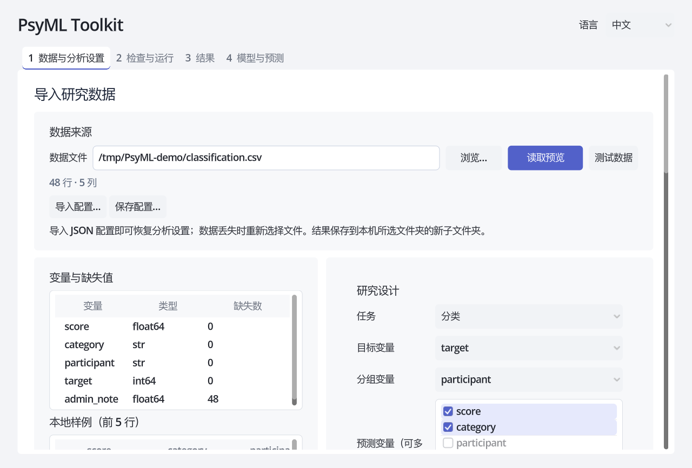

2. 选择分类或回归、目标变量、可选分组变量、缺失值与缩放策略、验证方法和模型。重复测量或同一参与者多行数据应选择分组变量与分组验证。

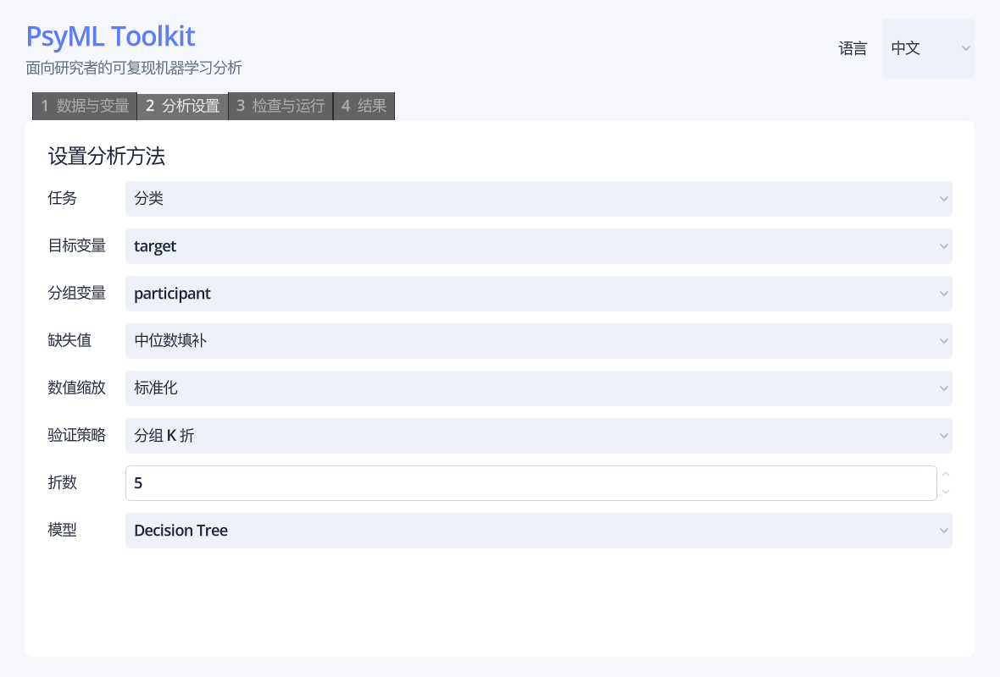

3. 选择结果目录，检查完整 JSON 配置后运行。固定的随机种子和保存的 `analysis_config.json` 可用于重跑。

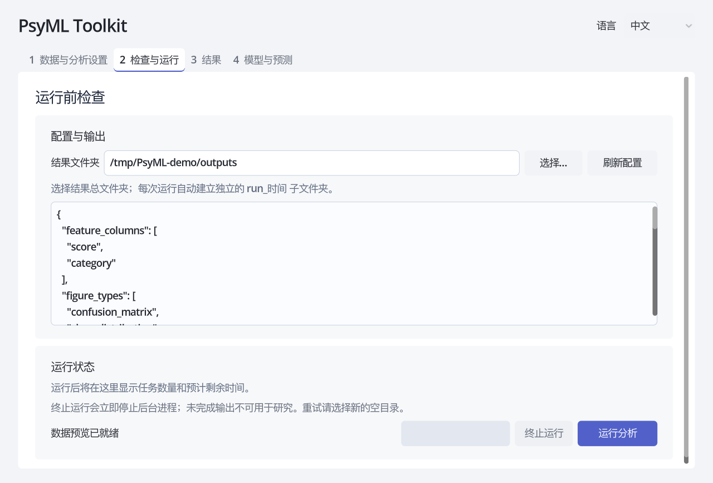

4. 查看风险提示、指标、预测和图形。“打开完整结果文件夹”可访问 CSV、JSON、PNG、Methods 与 reproducibility 文件。


截图使用随机合成数据，不包含真实参与者信息。公开可复查示例采用 UCI 的 [Iris（分类）](https://doi.org/10.24432/C56C76)与[混凝土抗压强度（回归）](https://doi.org/10.24432/C5PK67)，两者均为 CC BY 4.0；运行方法见 [公开示例说明](examples/public/README.md)。

### 项目状态与文档

Phase 0–14 已全部完成，现暂停扩展功能并进入研究者试用。Legacy 代码由仓库所有者编写，权属已经确认；它只作历史参考，不用于新分析。原始研究数据已经删除，仓库内数据均为随机合成数据；公开示例数据仅在本地按固定哈希下载，不提交进仓库。项目尚未选择许可证，因此公开可见并不自动授予他人复制、修改或分发代码的权利。

- [已完成阶段](docs/completed_phases.md)
- [隐私与知识产权审计](docs/privacy_ip_audit.md)
- [合成数据验证](docs/data_sanitization_verification.md)
- [Core JSON 接口](docs/core_interface.md)
- [Phase 13 完成记录](docs/phase_13_completion.md)
- [Phase 14 完成记录](docs/phase_14_completion.md)
- [发布审计](docs/release_audit.md)
- [人工验收流程](docs/manual_acceptance_test.md)

<a id="english"></a>

## English

PsyML Toolkit is a local machine-learning tool for researchers. New analyses use only the modern `src/psyml/` core. The Godot interface handles configuration and presentation, while the same Python core performs training, preprocessing, validation and metric calculation. Data are never uploaded.

It supports regression and classification, 23 models, 9 tabular formats, training-only preprocessing, 5 validation strategies, comprehensive metrics, predictions, figures, a Methods summary and a reproducibility report. The interface is available in Chinese, English and French.

### Quick start

Install Python 3.10–3.12, [uv](https://docs.astral.sh/uv/) and [Godot 4.7.2](https://godotengine.org/download/archive/4.7.2-stable/), then run from the repository root:

```bash
uv sync --locked --group dev
uv run python tools/launch_gui.py
```

For command-line use, run `uv run psyml --help`. If Godot is not on `PATH`, set `PSYML_GODOT` to the complete path of the Godot executable.

### Illustrated workflow

1. Choose a data file and select “Load preview”. Check its dimensions, variable types and missing values, then select predictors. The outcome and group columns are automatically excluded from predictors.

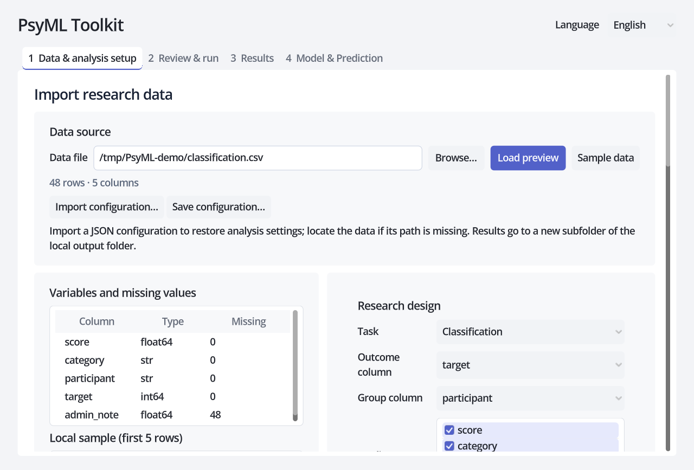

2. Select classification or regression, the outcome, an optional group column, preprocessing, validation and model. For repeated observations, use a group column and group-aware validation.

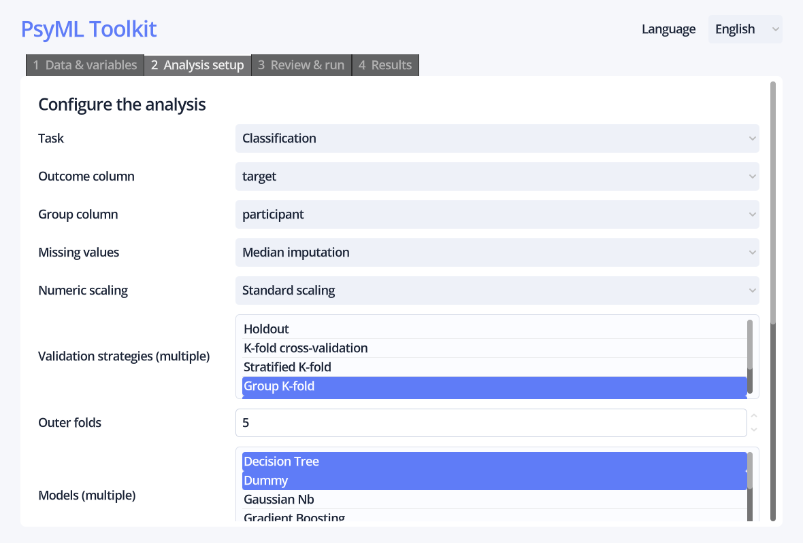

3. Choose the result folder, review the complete JSON configuration and run. The fixed seed and saved `analysis_config.json` support exact reruns.

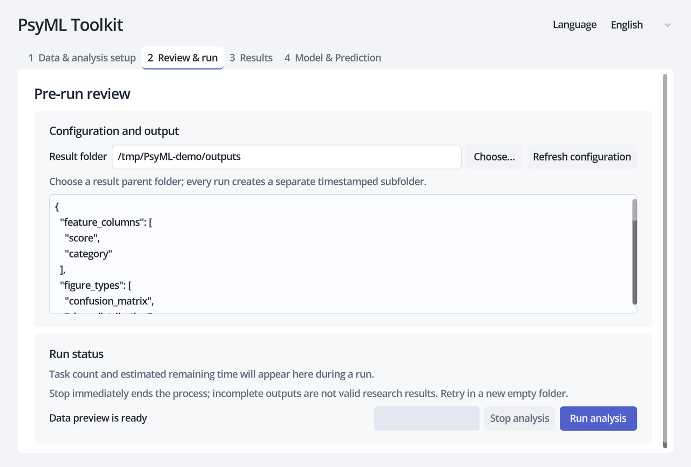

4. Inspect warnings, metrics, predictions and the figure. Open the complete result folder for CSV, JSON, PNG, Methods and reproducibility files.

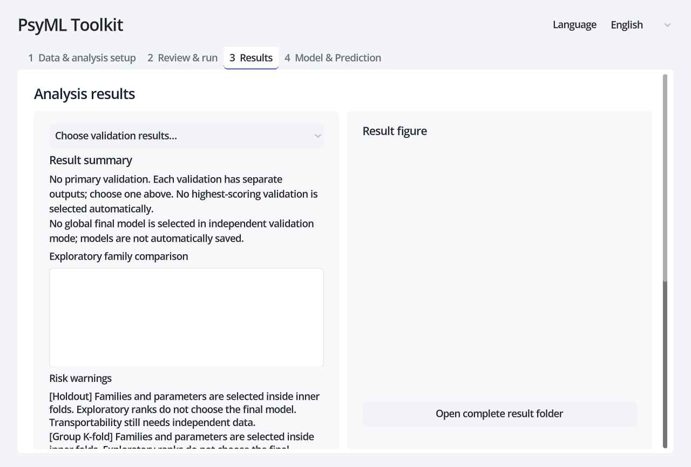

The screenshots use random synthetic data and contain no participant information. Auditable public examples use UCI’s CC BY 4.0 [Iris classification dataset](https://doi.org/10.24432/C56C76) and [Concrete Compressive Strength regression dataset](https://doi.org/10.24432/C5PK67); see the [public example instructions](examples/public/README.md).

Phases 0–14 are complete, feature expansion is paused, and the project is ready for researcher trials. The repository owner authored the legacy code and has confirmed its ownership; it remains historical reference only. Original research data have been removed. Repository datasets are randomly generated, while public examples are downloaded locally with pinned hashes and are not committed. No project license has been selected, so public visibility does not automatically grant permission to copy, modify or redistribute the code.

<a id="french"></a>

## Français

PsyML Toolkit est un outil local d’apprentissage automatique pour la recherche. Les nouvelles analyses utilisent uniquement le noyau moderne `src/psyml/`. L’interface Godot gère la configuration et l’affichage ; le même noyau Python réalise l’entraînement, le prétraitement, la validation et le calcul des métriques. Aucune donnée n’est téléversée.

L’outil prend en charge la régression et la classification, 23 modèles, 9 formats tabulaires, le prétraitement ajusté uniquement sur l’entraînement, 5 stratégies de validation, des métriques complètes, les prédictions, les figures, un résumé Methods et un rapport de reproductibilité. L’interface est disponible en chinois, anglais et français.

### Démarrage rapide

Installez Python 3.10–3.12, [uv](https://docs.astral.sh/uv/) et [Godot 4.7.2](https://godotengine.org/download/archive/4.7.2-stable/), puis exécutez depuis la racine du dépôt :

```bash
uv sync --locked --group dev
uv run python tools/launch_gui.py
```

Pour la ligne de commande : `uv run psyml --help`. Si Godot n’est pas dans le `PATH`, définissez `PSYML_GODOT` avec le chemin complet de l’exécutable Godot.

### Parcours illustré

1. Choisissez un fichier puis « Charger l’aperçu ». Vérifiez les dimensions, les types et les valeurs manquantes, puis sélectionnez les prédicteurs. La cible et le groupe sont automatiquement exclus.

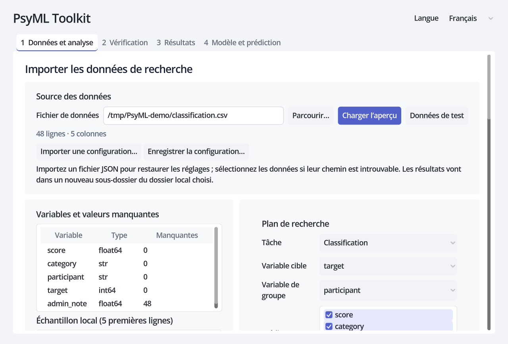

2. Choisissez la classification ou la régression, la cible, un groupe éventuel, le prétraitement, la validation et le modèle. Pour des observations répétées, utilisez une variable de groupe et une validation par groupes.

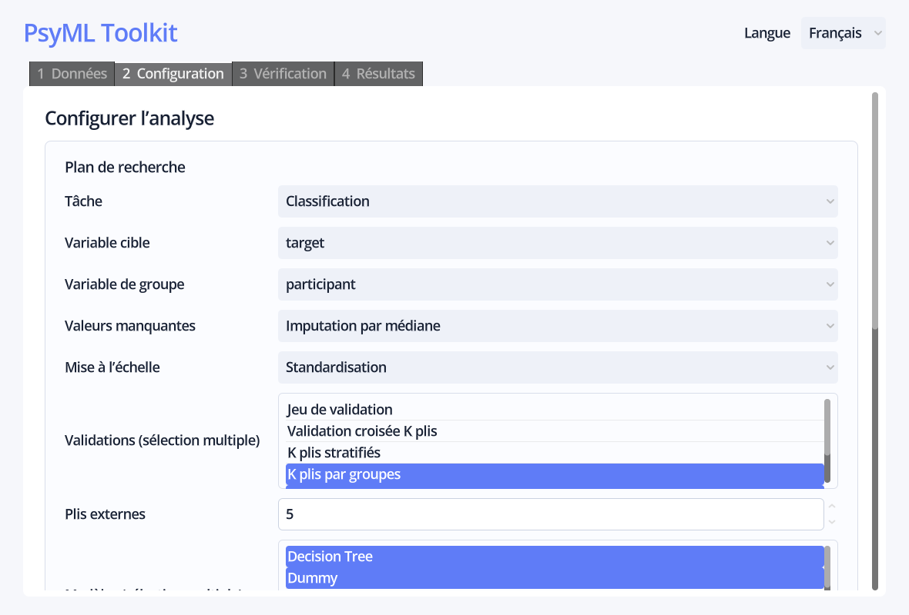

3. Choisissez le dossier de résultats, vérifiez la configuration JSON complète, puis lancez l’analyse. La graine fixe et le fichier `analysis_config.json` permettent de la reproduire.

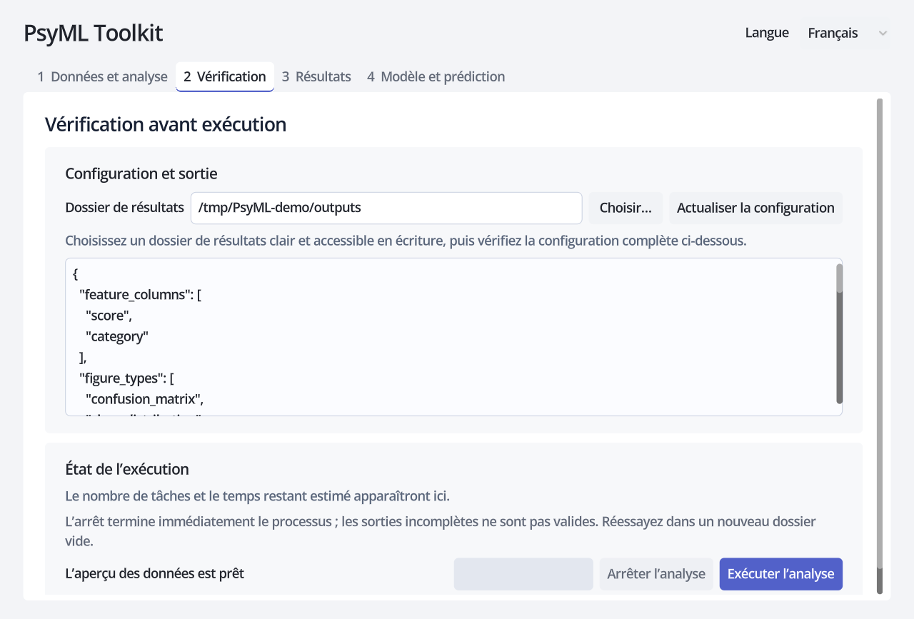

4. Consultez les alertes, les métriques, les prédictions et la figure. Ouvrez le dossier complet pour accéder aux fichiers CSV, JSON, PNG, Methods et de reproductibilité.

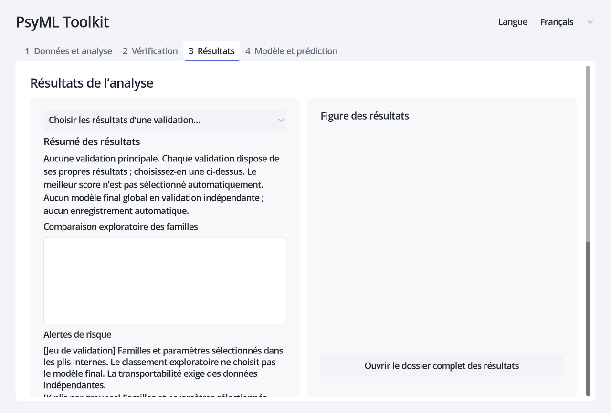

Les captures utilisent des données synthétiques aléatoires sans information de participant. Les exemples publics vérifiables emploient les jeux UCI sous CC BY 4.0 [Iris pour la classification](https://doi.org/10.24432/C56C76) et [Concrete Compressive Strength pour la régression](https://doi.org/10.24432/C5PK67) ; voir les [instructions des exemples publics](examples/public/README.md).

Les phases 0–14 sont terminées, l’ajout de fonctionnalités est suspendu et le projet est prêt pour des essais par des chercheurs. Le propriétaire du dépôt a écrit le code historique et en a confirmé la propriété ; ce code sert uniquement de référence. Les données de recherche originales ont été supprimées. Les données du dépôt sont générées aléatoirement, tandis que les exemples publics sont téléchargés localement avec des empreintes figées et ne sont pas commités. Aucune licence de projet n’a encore été choisie : la visibilité publique n’accorde donc pas automatiquement le droit de copier, modifier ou redistribuer le code.
