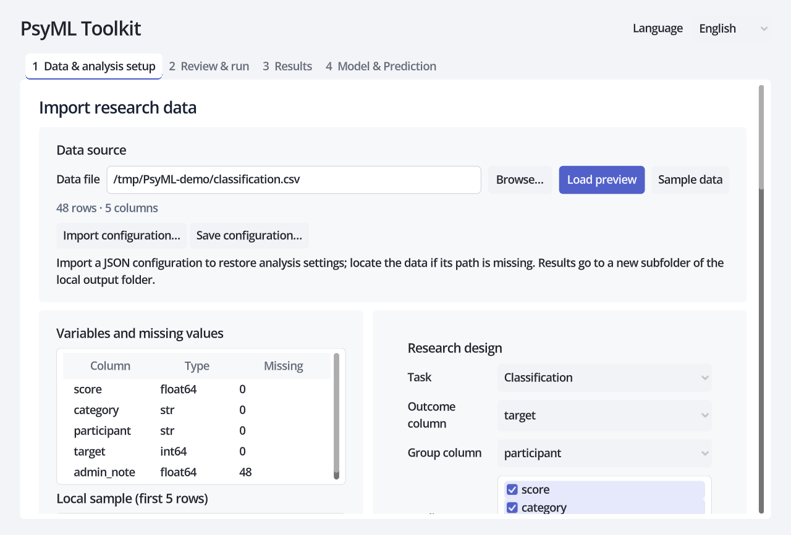

# PsyML Toolkit

English · [中文](README_ZH.md) · [Français](README_FR.md)

PsyML Toolkit is a desktop app for researchers to compare machine-learning models, check predictions and reproduce an analysis without writing code. Your data stay on your computer.

## What you can do

- Run classification and regression with preprocessing, model comparison and parameter search.
- Use grouped validation to keep repeated observations from the same participant together.
- Inspect metrics, predictions and figures; export reports and the settings used for the analysis.
- Save a trained model and predict new data; inspect fitted coefficients and optional SHAP explanations.
- Use the interface in English, Chinese or French.

## Get started

[Download the app](https://github.com/GuGuGu-coocoo/PsyMl_Toolkit/releases) for Apple Silicon Mac or Windows x64. Extract the whole archive and open PsyML Toolkit; keep the Windows `core` folder beside the executable.

For a first run, follow the [bundled-data quickstart](examples/quickstart/README.md#english): import its configuration, choose a results folder and run. The app includes its runtime, so this path requires no Python installation or terminal commands.

The available v0.3.0 installers predate the source fixes used in the linked validation records; a matching updated installer is not yet available.

## Contents

- [Public validation cases](#public-validation-cases)
- [Documentation](#documentation)
- [Development and licence](#development-and-licence)

## Public validation cases

### DSA activity classification

Identify 19 activities from body sensors, using 9,120 records from 8 participants. [Download CSV](https://raw.githubusercontent.com/GuGuGu-coocoo/PsyMl_Toolkit/main/examples/public/downloads/dsa_torso_mean_std.csv) · [Download configuration](https://raw.githubusercontent.com/GuGuGu-coocoo/PsyMl_Toolkit/a1450dfc374b8a39109c41f2548fdc0dbcad23c1/examples/public/configs/dsa_group_nested_v1.json) · [Run the case and compare results](docs/VALIDATION_DSA_EN.md).

### California housing regression

Predict 1990 census-area median house value from eight features, using 20,640 rows. [Download CSV](https://raw.githubusercontent.com/GuGuGu-coocoo/PsyMl_Toolkit/main/examples/public/downloads/california_housing.csv) · [Download original v1 configuration](https://raw.githubusercontent.com/GuGuGu-coocoo/PsyMl_Toolkit/a1450dfc374b8a39109c41f2548fdc0dbcad23c1/examples/public/california_random_nested_v1/california_config.json) · [Run the case and compare results](docs/CALIFORNIA_VALIDATION_EN.md).

The CSVs are ready to import. Each case gives the GUI steps, recorded results and their software environment. [Original data, conversion scripts and licences](examples/public/downloads/README.md) are available if you want to inspect the preparation; running those scripts is optional.

## Documentation

- [Application walkthrough](docs/RESEARCHER_GUIDE_EN.md#gui-workflow): importing data, choosing settings, running and reading results.
- [Researcher reference](docs/RESEARCHER_GUIDE_EN.md): models, metrics, validation, prediction and interpretation limits.
- [Quickstart files](examples/quickstart/README.md#english): synthetic training data, configurations and prediction examples.
- [Developer guide](docs/DEVELOPMENT_EN.md): source installation, command-line interfaces, tests and builds.

## Development and licence

Code and documentation use [Apache 2.0](LICENSE); third-party data and dependencies retain their own licences. See the [developer guide](docs/DEVELOPMENT_EN.md) to contribute or report a reproducible problem through [GitHub Issues](https://github.com/GuGuGu-coocoo/PsyMl_Toolkit/issues). Use public or synthetic examples when reporting issues; do not upload private participant data.
