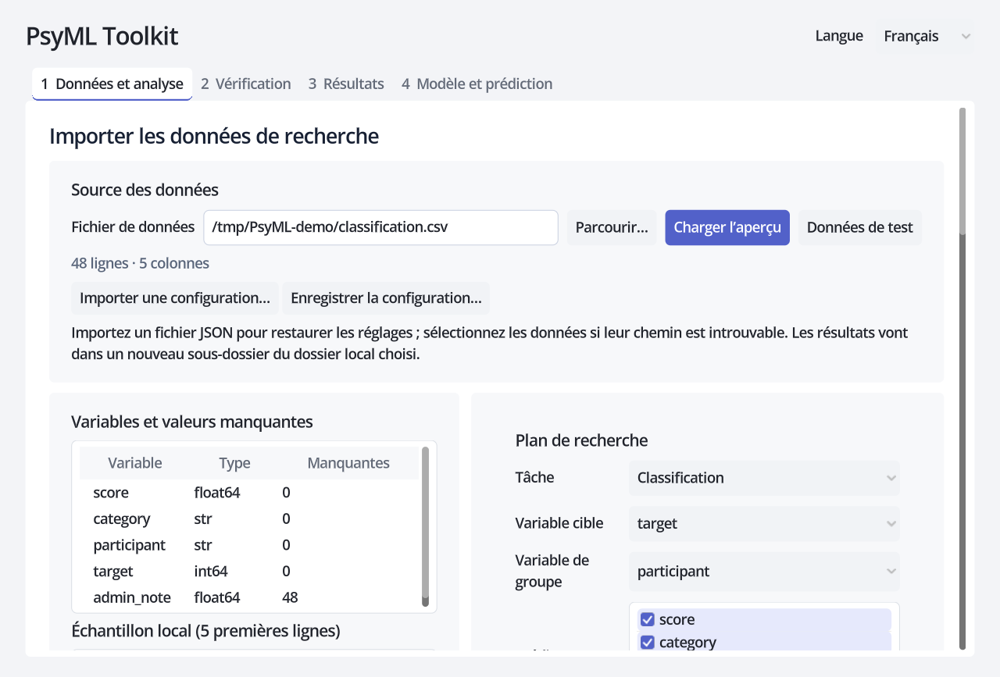

# PsyML Toolkit

[English](README.md) · [中文](README_ZH.md) · Français

PsyML Toolkit est une application de bureau pour comparer des modèles d’apprentissage automatique, examiner les prédictions et reproduire une analyse sans écrire de code. Les données restent sur votre ordinateur.

## Fonctions

- Classification et régression avec prétraitement, comparaison des modèles et recherche de paramètres.
- Validation groupée pour garder ensemble les observations répétées d’un même participant.
- Consultation des métriques, prédictions et figures ; export des rapports et des réglages de l’analyse.
- Enregistrement d’un modèle et prédiction de nouvelles données ; coefficients ajustés et explications SHAP facultatives.
- Interface en français, anglais et chinois.

## Commencer

[Téléchargez l’application](https://github.com/GuGuGu-coocoo/PsyMl_Toolkit/releases) pour Mac avec puce Apple ou Windows x64. Décompressez l’archive entière puis ouvrez PsyML Toolkit ; sous Windows, gardez le dossier `core` à côté du programme.

Pour une première analyse, suivez le [démarrage avec les données fournies](examples/quickstart/README.md#français) : importez la configuration, choisissez un dossier de résultats et lancez l’analyse. L’environnement est inclus ; ce parcours ne demande ni installation de Python ni commande dans un terminal.

Les installateurs v0.3.0 disponibles sont antérieurs aux correctifs source utilisés dans les relevés de validation ; aucun nouvel installateur correspondant n’est encore proposé.

## Sommaire

- [Cas de validation publics](#cas-de-validation-publics)
- [Documentation](#documentation)
- [Développement et licence](#développement-et-licence)

## Cas de validation publics

### Classification des activités DSA

Reconnaître 19 activités à partir de capteurs corporels : 9 120 enregistrements de 8 participants. [Télécharger le CSV](https://raw.githubusercontent.com/GuGuGu-coocoo/PsyMl_Toolkit/main/examples/public/downloads/dsa_torso_mean_std.csv) · [Télécharger la configuration](https://raw.githubusercontent.com/GuGuGu-coocoo/PsyMl_Toolkit/a1450dfc374b8a39109c41f2548fdc0dbcad23c1/examples/public/configs/dsa_group_nested_v1.json) · [Exécuter et comparer les résultats](docs/VALIDATION_DSA_FR.md).

### Régression California Housing

Prédire la valeur médiane des logements par zone du recensement de 1990 avec huit variables, sur 20 640 lignes. [Télécharger le CSV](https://raw.githubusercontent.com/GuGuGu-coocoo/PsyMl_Toolkit/main/examples/public/downloads/california_housing.csv) · [Configuration originale v1](https://raw.githubusercontent.com/GuGuGu-coocoo/PsyMl_Toolkit/a1450dfc374b8a39109c41f2548fdc0dbcad23c1/examples/public/california_random_nested_v1/california_config.json) · [Exécuter et comparer les résultats](docs/CALIFORNIA_VALIDATION_FR.md).

Les CSV sont prêts à importer. Chaque cas précise les étapes dans l’interface, les résultats enregistrés et leur environnement logiciel. Les [données originales, scripts de conversion et licences](examples/public/downloads/README.md) permettent d’examiner la préparation ; exécuter ces scripts reste facultatif.

## Documentation

- [Parcours dans l’application](docs/RESEARCHER_GUIDE_FR.md#gui-workflow) : importer, régler, exécuter et consulter les résultats.
- [Référence pour les chercheurs](docs/RESEARCHER_GUIDE_FR.md) : modèles, métriques, validation, prédiction et limites d’interprétation.
- [Fichiers de démarrage](examples/quickstart/README.md#français) : données synthétiques, configurations et exemples à prédire.
- [Guide de développement](docs/DEVELOPMENT_FR.md) : installation des sources, interfaces CLI, tests et construction.

## Développement et licence

Le code et la documentation sont sous [Apache 2.0](LICENSE) ; données et dépendances tierces gardent leurs licences. Consultez le [guide de développement](docs/DEVELOPMENT_FR.md) pour contribuer ou signalez un problème reproductible dans [GitHub Issues](https://github.com/GuGuGu-coocoo/PsyMl_Toolkit/issues). Utilisez des exemples publics ou synthétiques, sans données privées de participants.
