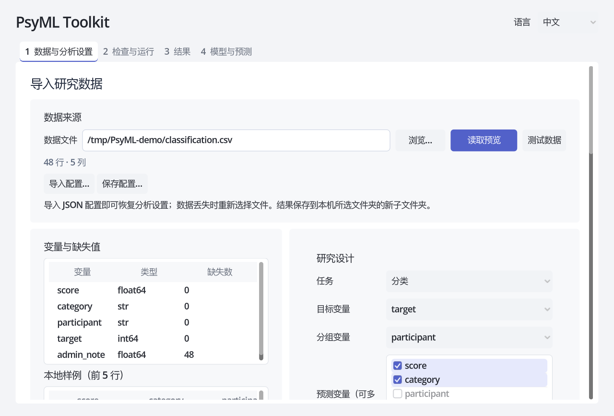

# PsyML Toolkit

[English](README.md) · 中文 · [Français](README_FR.md)

PsyML Toolkit 是面向研究者的桌面机器学习工具，用来比较模型、检查预测和复现分析，不用编写代码。数据在自己的电脑上处理。

## 可以做什么

- 完成分类与回归分析，包括预处理、模型比较和参数搜索。
- 选择分组验证，让同一参与者的重复记录留在同一侧。
- 查看指标、预测和图形，导出报告及本次分析设置。
- 保存训练好的模型并预测新数据，查看拟合系数和可选的 SHAP 解释。
- 在中文、英文和法文界面之间切换。

## 开始使用

[下载应用](https://github.com/GuGuGu-coocoo/PsyMl_Toolkit/releases)，支持 Apple 芯片 Mac 和 Windows x64。完整解压后打开 PsyML Toolkit；Windows 的 `core` 文件夹需与程序放在一起。

第一次使用可以照着[内置数据快速开始](examples/quickstart/README.md#中文)：导入配置，选择结果文件夹，运行分析。应用自带运行环境，这个流程不用安装 Python，也不用输入命令。

目前可下载的 v0.3.0 安装包早于验证记录使用的源码修复，包含这些修复的新安装包尚未提供。

## 目录

- [公开验证案例](#公开验证案例)
- [文档导航](#文档导航)
- [开发与许可](#开发与许可)

## 公开验证案例

### DSA 活动分类

用身体传感器识别 19 种活动，数据包括 8 名参与者的 9,120 条记录。[下载 CSV](https://raw.githubusercontent.com/GuGuGu-coocoo/PsyMl_Toolkit/main/examples/public/downloads/dsa_torso_mean_std.csv) · [下载配置](https://raw.githubusercontent.com/GuGuGu-coocoo/PsyMl_Toolkit/a1450dfc374b8a39109c41f2548fdc0dbcad23c1/examples/public/configs/dsa_group_nested_v1.json) · [运行步骤与结果对照](docs/VALIDATION_DSA_ZH.md)。

### California 房价回归

用八个地区特征预测 1990 年人口普查中的房价中位数，共 20,640 行。[下载 CSV](https://raw.githubusercontent.com/GuGuGu-coocoo/PsyMl_Toolkit/main/examples/public/downloads/california_housing.csv) · [下载原始 v1 配置](https://raw.githubusercontent.com/GuGuGu-coocoo/PsyMl_Toolkit/a1450dfc374b8a39109c41f2548fdc0dbcad23c1/examples/public/california_random_nested_v1/california_config.json) · [运行步骤与结果对照](docs/CALIFORNIA_VALIDATION_ZH.md)。

CSV 已处理好，可直接导入。案例页列出界面操作、参考结果及其软件环境。需要查看数据处理过程时，可查阅[原始数据、转换脚本与许可](examples/public/downloads/README.md)；运行脚本不是复现的必需步骤。

## 文档导航

- [软件操作步骤](docs/RESEARCHER_GUIDE_ZH.md#gui-workflow)：导入数据、选择设置、运行和查看结果。
- [研究者参考](docs/RESEARCHER_GUIDE_ZH.md)：模型、指标、验证、预测与解释范围。
- [快速开始文件](examples/quickstart/README.md#中文)：合成训练数据、配置和新数据预测样本。
- [开发者指南](docs/DEVELOPMENT_ZH.md)：源码安装、命令行接口、测试与构建。

## 开发与许可

代码和文档采用 [Apache 2.0](LICENSE)，第三方数据和依赖遵循各自许可。参与开发见[开发者指南](docs/DEVELOPMENT_ZH.md)，问题反馈可提交到 [GitHub Issues](https://github.com/GuGuGu-coocoo/PsyMl_Toolkit/issues)。请使用公开或合成的最小示例，不要上传私人参与者数据。
