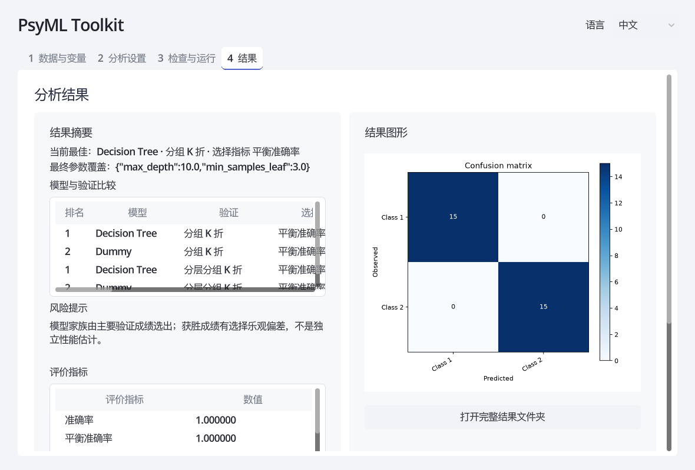

# GUI 视觉与状态说明

2026-09-05。在修改前实际启动 Godot 4.7.2，保存并查看四个关键页面；之后访问并查看 [Linear 官方 Features 页面](https://linear.app/features) 的公开界面。参考其有限强调色、清晰文字层级、轻分隔及主次动作区分；保留 PsyML 的浅色背景、研究术语和四页结构，没有复制其深色营销页面，也未引入新框架。

## 变化与四页前后截图

中文前后图均为 1180×800 的真实 Godot 视口，同一30行仓库合成夹具、Decision Tree + Dummy、两种分组验证和相同有限搜索。输出目录按每次运行生成新路径，因此路径不同；最终版本增加的参数与风险说明属于正确性修复。截图是直接从正在运行的视口保存，未经图片编辑。

| 页面 | 修改前 | 修改后 | 可见变化 |
|---|---|---|---|
| 数据与变量 | [修改前](before/01-data.png) | [修改后](after/zh/01-data.png) | 去掉深灰表头；去除无内容的树根行；外面板去边框、表格保留细边界；“读取预览”为主动作，“浏览…”为次动作。目标/组禁用有 tooltip。 |
| 分析设置 | [修改前](before/02-configure.png) | [修改后](after/zh/02-configure.png) | 页签用浅底和下边线区分当前页；多选用浅色填充；统一6px圆角与文字色；长目标名称不再撑大整个表单。 |
| 检查与运行 | [修改前](before/03-review.png) | [修改后](after/zh/03-review.png) | 只有“运行分析”强调；次要按钮浅底；取消改为“终止运行”，增加立即停止/不完整输出的准确说明；缩短配置预览高度以完整显示操作行；非空目录禁止覆盖。 |
| 结果 | [修改前](before/04-results.png) | [修改后](after/zh/04-results.png) | 轻表头、明确的最终参数覆盖；风险文字不再继承默认浅色；无风险时给出文字而非空白；保持横向表格滚动与预测预览结构。 |

前后总览可点击上表对比；下面示例展示最终结果页：

共享样式仍在 `gui/scripts/main.gd` 的 `_build_theme`，使用 TEXT、MUTED、SURFACE、BORDER、ACCENT、RADIUS 常量。固定布局、控件高度与分组保留在 `gui/main.tscn`。常规输入/按钮维持42px基准，正文16px、分组18px、页标题23px、应用标题27px；不按每个按钮分别堆叠局部颜色。输入边框用于操作辨识，外层面板用背景/留白分组。

## 状态与实际观察范围

| 状态/场景 | 验证与证据 | 边界 |
|---|---|---|
| 默认、选中、禁用 | 四页截图；[只读参数区](after/zh/05-parameters.png) | 预设参数值与禁用标签已加强对比。禁用原因通过配置区域、说明和 tooltip 提供，不只依赖颜色。 |
| 键盘焦点 | [法文焦点按钮](boundaries/keyboard-focus.png)，实际调用 Godot grab_focus 后渲染 | 发现焦点字体继承浅色并修复，最终文字与边框可见；未做完整屏幕阅读器审核。 |
| 悬停、按下 | 共用主题定义 normal/hover/pressed/focus/disabled，主/危险按钮对应字体状态均已设置 | **未实际观察鼠标悬停及持续按下的最终画面**。桌面辅助工具只定位到 Godot 项目管理器，未可靠接管 PsyML 窗口，故保留为人工步骤8/B7。不以样式定义冒充观察。 |
| 加载/运行 | [运行中](states/07-running.png)；输入锁定、终止可用、进度文字存在 | 截图包含准备阶段；自动测试观察到完成事件。短任务不能保证每个训练阶段都有肉眼可见帧。文件预览异步状态有脚本逻辑与流程测试，未单独保存加载帧。 |
| 终止 | [已终止](states/08-stopped.png)；实际结束后台分析并检查旧结果已清空 | 立即停止，没有删除动作；文件对话框“取消”仍是放弃选择。页面内没有删除功能，无需引入删除确认。 |
| 错误与恢复 | [组数不足错误](states/09-error.png)；实际修正为3折后重新完成 | 错误前缀和正文、进度状态同时说明失败；颜色不是唯一线索。部分技术错误详情来自 Python，仍可能为英文。 |
| 三语结果刷新 | [英文结果](after/en/04-results.png)、[法文结果](after/fr/04-results.png)；流程断言比较表表头与最佳说明随语言变化 | 模型名、参数键保留研究/技术标识。全部翻译并未声称经过专业法文校对。 |
| 缩放 | 中文1180×800；英文实际1327×900；法文实际1000×677（内容截图像素） | 请求窗口尺寸分别为1440×900、1000×700；macOS边框/屏幕限制使实际视口不同。项目仍使用 canvas_items 随窗口缩放，小尺寸允许页面滚动，未改为响应式重排。 |
| 长路径/变量 | [中文长路径](boundaries/long-0-0.png)、[法文长目标](boundaries/long-2-1.png)，中英法均实际渲染 | 截断显示不改真实变量名；可通过tooltip、下拉项或完整配置核对。极长路径在单行框内需移动光标查看。 |
| 宽表与下方内容 | [中文预测区](after/zh/06-predictions.png)、[法文参数区](after/fr/05-parameters.png) | 表格需横向滚动；GUI比较只显示前30条、预测前20条，全部数据在CSV；不声称一屏容纳所有信息。 |

## 与人工指南的一致性

另用指南自带的48行数据按指南设置实际运行：

- [分类结果](manual-fixtures/classification/04-results.png)：分组3折、Decision Tree + Dummy、推荐范围搜索、内部2折、最多2候选。
- [回归结果](manual-fixtures/regression/04-results.png)：分组3折、Linear Regression、不搜索。
- 结果随运行自动导出；实际按钮为“打开完整结果文件夹”，没有独立“导出”页。
- 文件按钮为“浏览…”；预览后会自动跳转“分析设置”；需要回数据页确认预测变量。研究变量角色不会替研究者识别管理标识。

截图生成过程与真实进程返回记录见 [gui-captures.txt](gui-captures.txt)。科学正确性结论单列于 [科学审查](SCIENTIFIC_REVIEW.md)；人工验收见 [中文指南](../GUI_MANUAL_TEST_ZH.md)。本轮未实测 Windows/Linux、原生文件对话框全部按钮、系统高DPI及辅助技术，不宣称跨平台视觉验收完成。
