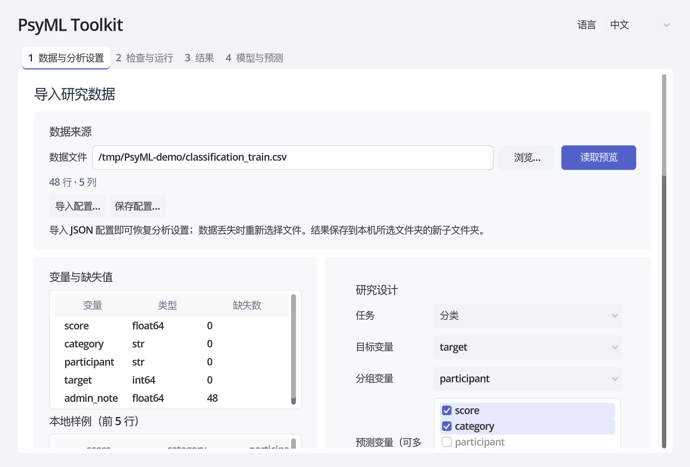
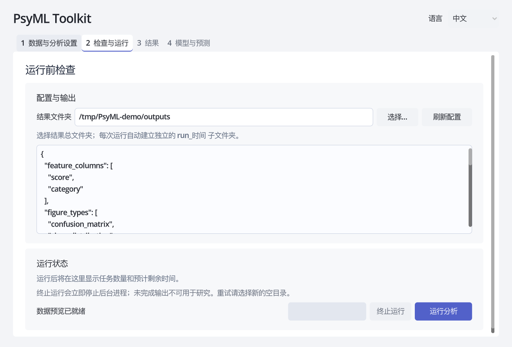
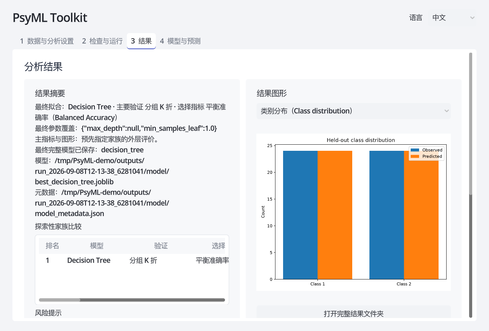
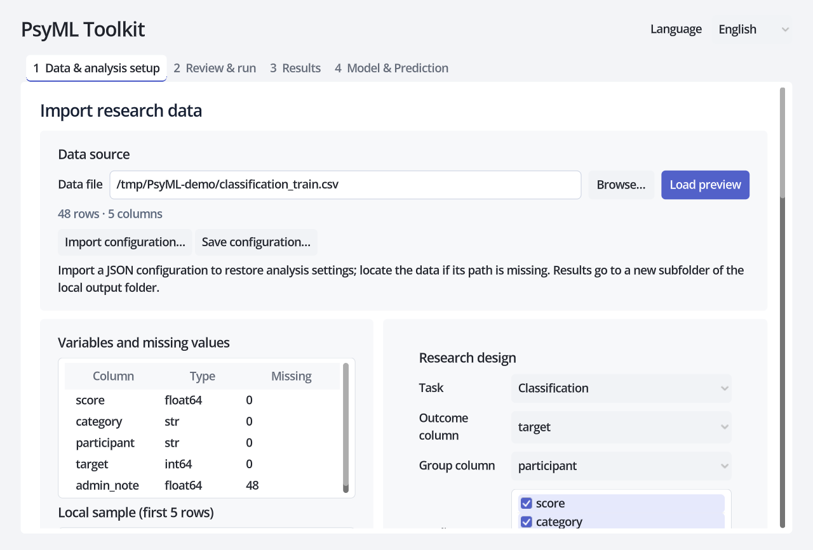
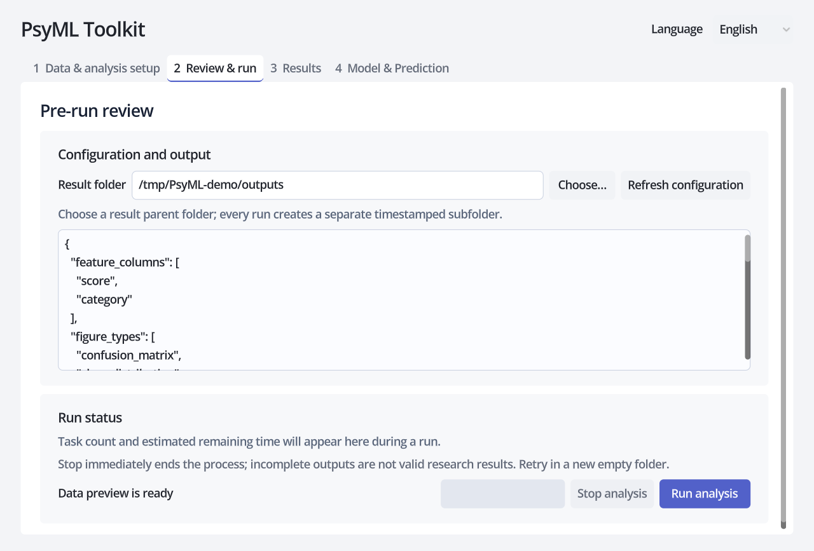
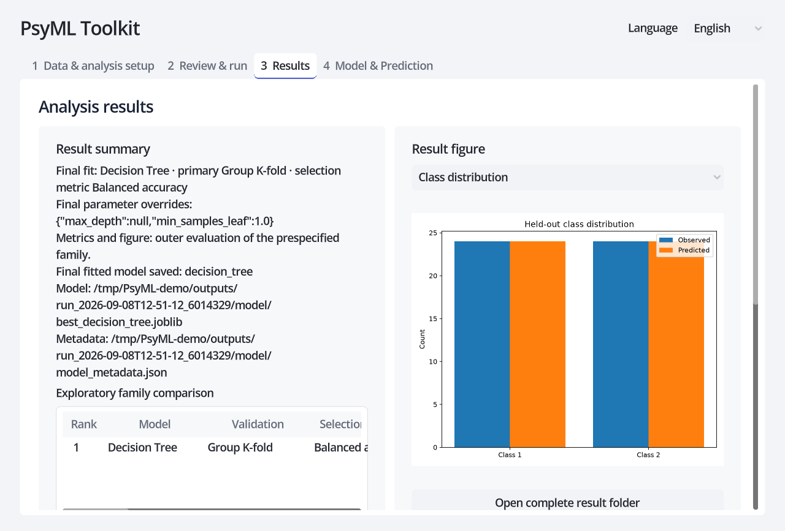
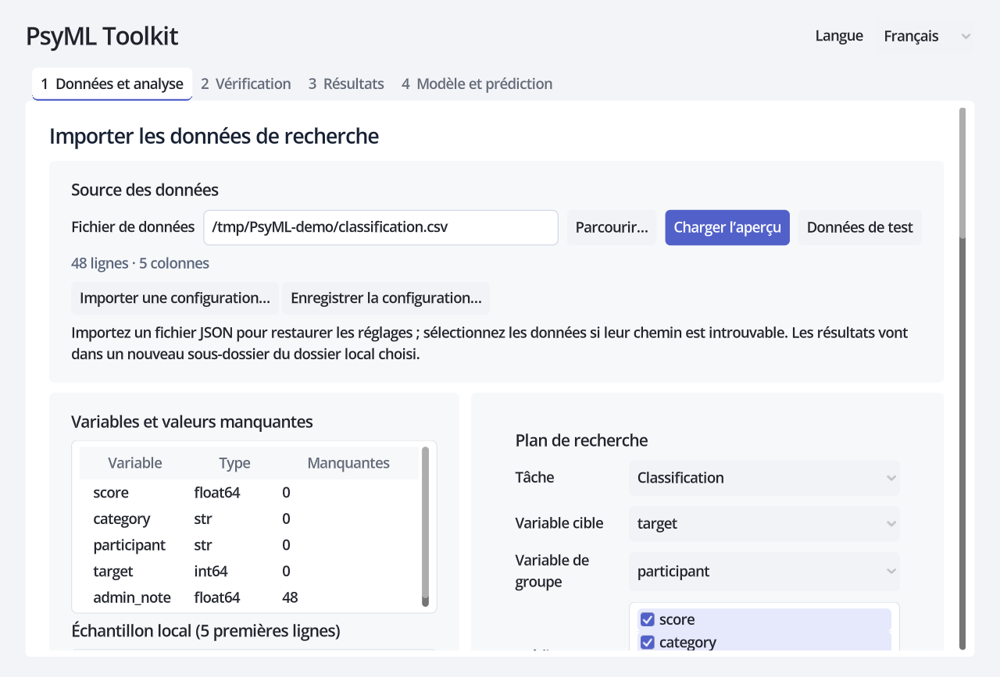
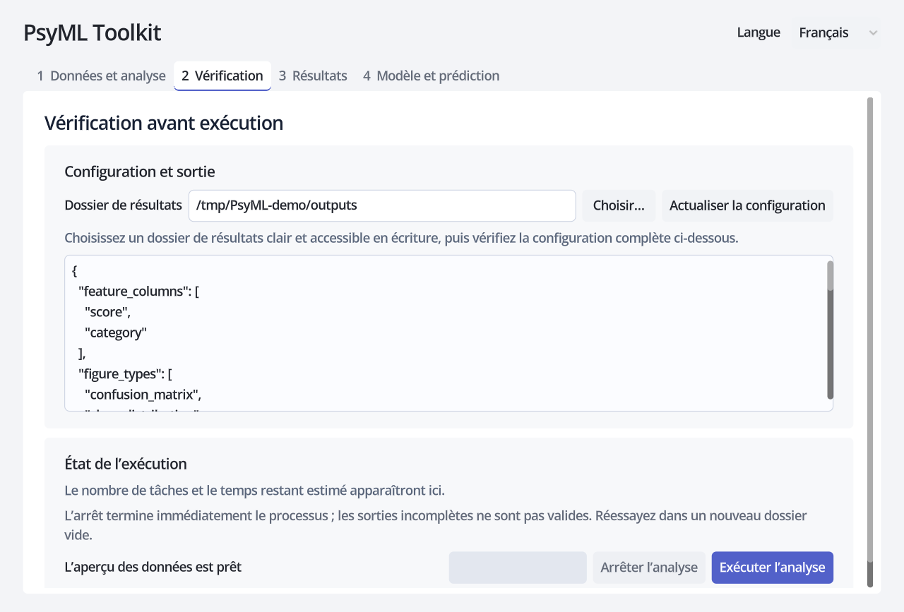
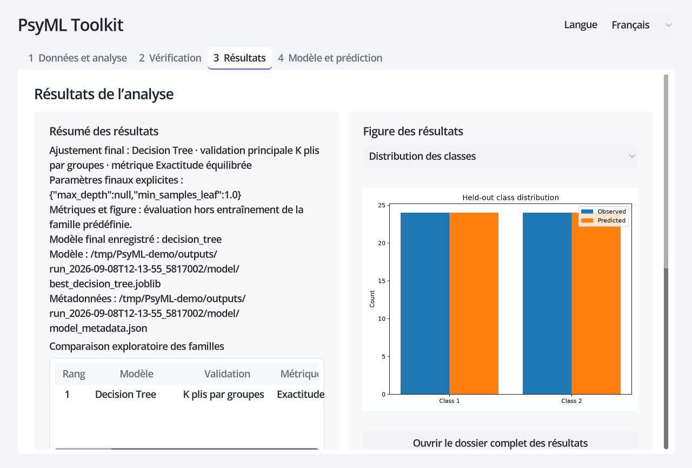

# 快速开始 / Quick start / Démarrage rapide

[中文](#中文) · [English](#english) · [Français](#français)

## 中文

用这些文件完成第一次训练和新数据预测。请保留或复制整个资料夹，让 JSON 与训练 CSV 放在一起。全部数据为合成数据，用来熟悉软件流程。

| 文件 | 用途 | 在哪里使用 |
| --- | --- | --- |
| [classification_config.json](classification_config.json) | 分类测试配置，自动关联训练数据；开启保存模型 | 第 1 页“导入配置…” |
| [classification_train.csv](classification_train.csv) | 48 行分类训练数据，含目标 target | 配置导入时自动读取，无需另外打开 |
| [classification_predict.csv](classification_predict.csv) | 10 行新样本，无目标列 | 第 4 页“加载预测数据…” |
| [regression_config.json](regression_config.json) | 回归测试配置，自动关联训练数据；开启保存模型 | 第 1 页“导入配置…” |
| [regression_train.csv](regression_train.csv) | 48 行回归训练数据，含目标 target | 配置导入时自动读取，无需另外打开 |
| [regression_predict.csv](regression_predict.csv) | 10 行新样本，无目标列 | 第 4 页“加载预测数据…” |

打开 PsyML Toolkit（独立应用 0.3.0 或更新版本）。下面沿用早期版本的合成分类截图，帮助查找按钮。请导入当前 JSON，不照抄图中的参数类型、路径或运行编号；本次结果以 `training/run_*/` 中的实际路径为准。

先完成分类分析：

1. 第 1 页点击“导入配置…”，选择 `classification_config.json`。对话框默认定位到此资料夹。训练数据和设置一起恢复，预测变量为 score/category；不要导入 `_predict.csv` 来训练。

   

2. 保持“保存最佳模型”勾选（第 1 页右侧向下滚动，随机种子下方）。到第 2 页选择结果保存位置并运行。

   

3. 第 3 页点击“打开完整结果文件夹”，在本次训练运行目录 `training/run_*/` 的 `model/` 中找到 `best_decision_tree.joblib`，保留旁边的 `model_metadata.json`。

   

4. 第 4 页确认模型来源可信，点击“加载模型…”选择上述模型；点击“加载预测数据…”选择 `classification_predict.csv`。首次打开该数据对话框也默认定位到此资料夹。
5. 自动检查通过后点击“运行预测”，应得到 10 行结果，保留 sample_id/category/score，并追加 predicted_class、probability_0、probability_1。结果写入本次运行目录 `prediction/run_*/predictions.csv`；点击“打开预测结果文件夹”打开该目录，界面不再提供另存对话框（需要其他表格格式时可用命令行 `psyml export-table`）。
6. 再导入 `regression_config.json`，重复训练；加载其 `best_ridge.joblib` 和 `regression_predict.csv`。应得到 10 行结果，追加 predicted_value，不生成概率列。

预测文件的变量顺序与训练不同，并额外保留 sample_id，用于检查自动选列和原始列保留。两组新样本都只需要 score/category，不需要目标或分组列。预测数值随配置和依赖版本可能不同；这里只检查流程和输出结构，不验证真实模型效果。

若测试错误提示，请先复制一份预测 CSV，删除 score 列或把其值改成文字后加载；预期会阻止预测。不要改动原始测试文件。旧的 `examples/synthetic/` 保留给现有开发测试；用户试用从本资料夹开始。

### 置换重要性测试（可选）

改导入 `classification_permutation_config.json` 或 `regression_permutation_config.json` 可检查新增的置换重要性（原有两个配置仍默认关闭，行为不变）。配置已开启“导出置换重要性”且重复次数为 10。在第 2 页运行后，第 3 页“置换重要性”区域应显示所选验证的汇总表与状态，并可点击“打开解释产物文件夹”查看本次 `training/run_*/interpretations/<验证>/`：其中含逐次 `permutation_raw.csv`、逐折 `permutation_folds.csv`、汇总 `permutation_summary.csv`、`permutation.json` 和有符号排序图 `permutation_importance.png`。数值有符号：MAE/RMSE 表示误差升高，其他指标表示性能下降；保留负值，不归一化为百分比，不是因果关系或置信区间，相关变量会共享或掩盖贡献。若选择多个验证，可用结果页的验证选择器切换查看各自的解释。

### 单样本 SHAP 解释测试（可选，需 explain 依赖）

按上文训练分类或回归并加载其保存模型与 `_predict.csv`。在第 4 页“解释单个样本（近似 SHAP）”区，把“加载背景参考数据…”也选择同一个 `_predict.csv`，样本行号填 1，背景行数 10、排列轮数 2；分类再选择要解释的类别。点击“解释这个样本”，首次可能较慢，可随时取消。完成后应看到基值、输出、重建误差、按绝对值排序的贡献表，以及从基值逐项累加到输出的**累计瀑布图**（正负方向、原始变量名与值、TopN 与“其余 N 项之和”），只保留“打开瀑布图”与“打开结果文件夹”两个入口，没有复制或另存导出。产物写入所选结果根目录的 `explanation/run_*/`：`shap_explanation.json`、`shap_contributions.csv`、`shap_waterfall.png`、`shap_explanation_notes.md`。切换行/类别/设置或离开页面只清除界面，已完成的产物保留在磁盘。贡献是有限排列的近似 SHAP（`base + Σφ = 所选输出`，容差 1e-7/1e-6），不是精确 SHAP、不是因果，也不代表外层测试性能；首版仅支持 logistic/decision tree/random forest（分类）与 linear/ridge/lasso/elastic net/decision tree/random forest（回归），且仅接受带 PsyML 导出元数据的保存模型。独立应用已包含所需解释依赖。只有源码环境需要另行安装 `explain` 扩展（`uv sync --extra explain`）；缺少扩展时该区不可用，普通预测不受影响。

### 拟合系数与截距测试（不需要 explain 依赖）

用回归的 `best_ridge.joblib` 或分类的 logistic 模型（可另建配置把 `model_name` 设为 `logistic_regression`）加载模型与 `_predict.csv`。在第 4 页“拟合系数与截距”区点击“查看拟合系数”：应显示预处理后空间中的每个变换特征、来源列与系数，分类另标类别轴；若预测数据兼容会显示重建核验通过（容差 1e-7/1e-6），无数据则明确“未核验”。界面逐输出轴显示截距、单位与拟合范围，并区分“未核验”与“核验失败”；核验失败不会写出任何系数产物。结果区只保留“打开结果文件夹”入口（指向本次 `coefficients/run_*/`），没有复制或另存导出。常规分析也会在本次训练运行目录的 `coefficients/` 写入 `coefficients.csv`、`coefficients.json`、`coefficients_notes.md`。这些是最终全数据模型的**已拟合参数**，不是超参数，也不含 p 值、置信区间、显著性、因果或标准化效应；决策树、随机森林、非线性核、多类 SVC 等会给出具体不支持原因，普通预测和 SHAP 不受影响。命令行等价：`psyml coefficients --model … --trust-model --input … --output-dir …`（或 `--check-only`）。

## English

Use these files for your first training run and new-data prediction. Keep or copy the whole folder so each JSON stays beside its training CSV. All data is synthetic and intended for learning the workflow.

| File | Purpose | Use |
| --- | --- | --- |
| [classification_config.json](classification_config.json) | Classification settings with model saving enabled | Page 1: Import configuration… |
| [classification_train.csv](classification_train.csv) | 48 training rows including target | Loaded automatically by the configuration |
| [classification_predict.csv](classification_predict.csv) | 10 new samples without target | Page 4: Load prediction data… |
| [regression_config.json](regression_config.json) | Regression settings with model saving enabled | Page 1: Import configuration… |
| [regression_train.csv](regression_train.csv) | 48 training rows including target | Loaded automatically by the configuration |
| [regression_predict.csv](regression_predict.csv) | 10 new samples without target | Page 4: Load prediction data… |

Open PsyML Toolkit (standalone version 0.3.0 or later). The screenshots reuse an earlier synthetic classification example to show the controls. Import the current JSON; do not copy pictured parameter types, paths or run IDs. Use this run’s actual paths under `training/run_*/`.

1. On page 1, choose **Import configuration…** and select `classification_config.json`. Its training data and settings load together. Keep **Save best model** enabled below Random seed in the lower settings area.

   

2. On page 2, choose a local results folder and click **Run analysis**.

   

3. On page 3, open the complete result folder. Keep this run's `training/run_*/model/best_decision_tree.joblib` together with `model_metadata.json`.

   

4. On page 4, confirm that the model is trusted, load that model, then load `classification_predict.csv`. The configuration and first prediction-data dialogs start in this folder.
5. When automatic checks pass, run prediction. Expect 10 rows with the original sample_id/category/score plus predicted_class and probability_0/probability_1, written to this run's `prediction/run_*/predictions.csv`. **Open prediction results folder** opens that run folder; no save-as dialog is needed. For other table formats, the optional `psyml export-table` command is available.

Repeat with the regression JSON, its saved `best_ridge.joblib`, and `regression_predict.csv`: 10 rows, with predicted_value and no probability columns. Do not train on the `_predict.csv` files. Their feature order differs from training, and extra sample_id values test column preservation. Predictors require only score/category; no target/group column is needed. Exact predictions may vary with settings and dependency versions; this is not a validation of real-world model quality.

For error testing, make a separate copy of prediction data and remove score or replace numbers with text; prediction should be blocked. Preserve the original files. `examples/synthetic/` remains for existing developer tests; start user testing here.

### Permutation-importance test (optional)

Import `classification_permutation_config.json` or `regression_permutation_config.json` to exercise the new permutation importance (the original two configs stay off by default and are unchanged). Both enable **Export permutation importance** with 10 repeats. After running on page 2, the page-3 **Permutation importance** block shows the selected validation's summary and status; **Open interpretation folder** reveals this run's `training/run_*/interpretations/<validation>/` containing raw `permutation_raw.csv`, per-fold `permutation_folds.csv`, summary `permutation_summary.csv`, `permutation.json` and the signed figure `permutation_importance.png`. Values are signed (error increase for MAE/RMSE, otherwise performance drop), keep negatives, are not normalised percentages, not causal and not confidence intervals; correlated variables share or mask attribution. When several validations are selected, switch between them with the results-page validation selector.

### Single-sample SHAP test (optional, needs the explain extra)

Train classification or regression as above, then load its saved model and `_predict.csv`. In the page-4 **Explain one sample (approximate SHAP)** block, also choose the same `_predict.csv` as the background reference, set sample row 1, background rows 10 and cycles 2, and for classification choose the class. Click **Explain this sample**; the first run may be slow and can be cancelled. You should see base value, output, reconstruction error, contributions sorted by absolute value, and a **cumulative waterfall** stepping from base to output (signed direction, original names/values, top N plus "other N (sum)"), with only **Open waterfall image** and **Open results folder**; there is no copy or save-as export. Artifacts are written to `explanation/run_*/` under the selected result root: `shap_explanation.json`, `shap_contributions.csv`, `shap_waterfall.png` and `shap_explanation_notes.md`; changing row/class/settings or leaving the page only clears the display and keeps completed artifacts on disk. Contributions are approximate finite-permutation SHAP (`base + Σφ = selected output`, tolerance 1e-7/1e-6), not exact SHAP, not causal and not outer test performance; the first release covers logistic/decision tree/random forest (classification) and linear/ridge/lasso/elastic net/decision tree/random forest (regression), and only accepts saved models with PsyML export metadata. Without `uv sync --extra explain` the section is unavailable and ordinary prediction still works.

### Fitted-coefficients test (no explain extra needed)

Load the regression `best_ridge.joblib` or a logistic classification model (a config with `model_name` set to `logistic_regression` works) together with `_predict.csv`. In the page-4 **Fitted coefficients and intercepts** block click **View fitted coefficients**: it lists each transformed feature, its source column and coefficient in the preprocessed space, and for classification labels the class axis. With compatible prediction data it shows reconstruction verified (tolerance 1e-7/1e-6); without data it explicitly says "not verified". The block shows the intercept, unit and fit scope per output axis and distinguishes "unverified" from "verification failed"; a failed check produces no coefficient artifact. Only **Open results folder** remains (it points to this run's `coefficients/run_*/`); there is no copy or save-as export. A normal analysis also writes `coefficients.csv`, `coefficients.json` and `coefficients_notes.md` under `coefficients/` in this run's training folder. These are fitted parameters of the final all-analyzed-rows model, not hyperparameters, with no p-values, confidence intervals, significance, causal claims or standardized effects; decision trees, random forests, non-linear kernels and multi-class SVC report a specific unsupported reason, and ordinary prediction and SHAP are unaffected. CLI equivalent: `psyml coefficients --model … --trust-model --input … --output-dir …` (or `--check-only`).

## Français

Utilisez ces fichiers pour votre premier entraînement et la prédiction de nouvelles données. Conservez ou copiez le dossier entier pour garder chaque JSON avec son CSV d’entraînement. Les données sont synthétiques et servent à apprendre le parcours.

| Fichier | Utilité | Utilisation |
| --- | --- | --- |
| [classification_config.json](classification_config.json) | Réglages de classification, modèle enregistré | Page 1 : Importer une configuration… |
| [classification_train.csv](classification_train.csv) | 48 lignes d’entraînement avec target | Chargé automatiquement par le JSON |
| [classification_predict.csv](classification_predict.csv) | 10 nouveaux exemples sans cible | Page 4 : Charger les données à prédire… |
| [regression_config.json](regression_config.json) | Réglages de régression, modèle enregistré | Page 1 : Importer une configuration… |
| [regression_train.csv](regression_train.csv) | 48 lignes d’entraînement avec target | Chargé automatiquement par le JSON |
| [regression_predict.csv](regression_predict.csv) | 10 nouveaux exemples sans cible | Page 4 : Charger les données à prédire… |

Ouvrez PsyML Toolkit (application autonome 0.3.0 ou ultérieure). Les captures reprennent un ancien exemple synthétique de classification pour montrer les commandes. Importez le JSON actuel sans recopier les types de paramètres, chemins ou identifiants de l’image ; utilisez ceux de votre dossier `training/run_*/`.

1. À la page 1, cliquez sur **Importer une configuration…** et choisissez `classification_config.json`. Données et réglages sont restaurés ensemble. Gardez l’enregistrement du meilleur modèle activé, sous la graine aléatoire en bas des réglages.

   

2. À la page 2, choisissez un dossier local de résultats et cliquez sur **Exécuter l’analyse**.

   

3. À la page 3, ouvrez le dossier complet des résultats. Conservez `training/run_*/model/best_decision_tree.joblib` de cette exécution avec `model_metadata.json`.

   

4. À la page 4, confirmez la confiance dans le modèle, chargez-le puis ouvrez `classification_predict.csv`. Les dialogues de configuration et de première sélection des données à prédire commencent dans ce dossier.
5. Après les contrôles automatiques, lancez la prédiction : 10 lignes avec sample_id/category/score conservés, plus predicted_class et probability_0/probability_1, dans `prediction/run_*/predictions.csv`. **Ouvrir le dossier des prédictions** ouvre ce dossier ; aucun dialogue d’enregistrement n’est nécessaire. La commande facultative `psyml export-table` permet d’autres formats de sortie.

Recommencez avec le JSON de régression, son `best_ridge.joblib` et `regression_predict.csv` : 10 lignes, predicted_value ajouté, sans probabilités. Ne pas entraîner sur les fichiers `_predict.csv`. Leur ordre de variables diffère et sample_id teste la conservation des colonnes supplémentaires. Seuls score/category sont requis, sans cible ni groupe. Les valeurs prédites peuvent varier selon les réglages et versions ; ceci ne valide pas les performances réelles.

Pour tester les erreurs, créez une copie des données à prédire, supprimez score ou remplacez les nombres par du texte : la prédiction doit être bloquée. Conservez les originaux. `examples/synthetic/` reste destiné aux tests de développement ; commencez les essais utilisateur ici.

### Test de l’importance par permutation (facultatif)

Importez `classification_permutation_config.json` ou `regression_permutation_config.json` pour essayer la nouvelle importance par permutation (les deux configurations d’origine restent désactivées par défaut et inchangées). Elles activent **Exporter l’importance par permutation** avec 10 répétitions. Après l’exécution (page 2), le bloc **Importance par permutation** (page 3) affiche le résumé et l’état de la validation choisie ; **Ouvrir le dossier d'interprétation** montre `training/run_*/interpretations/<validation>/` de cette exécution, avec `permutation_raw.csv` (brut), `permutation_folds.csv` (par pli), `permutation_summary.csv` (récapitulatif), `permutation.json` et la figure signée `permutation_importance.png`. Les valeurs sont signées (augmentation de l’erreur pour MAE/RMSE, sinon baisse de performance), conservent les négatifs, ne sont ni des pourcentages normalisés, ni causales, ni des intervalles de confiance ; les variables corrélées partagent ou masquent l’attribution. Avec plusieurs validations, utilisez le sélecteur de la page des résultats.

### Test d'explication SHAP d'un échantillon (facultatif, extension explain requise)

Entraînez la classification ou la régression ci-dessus, puis chargez son modèle enregistré et `_predict.csv`. Dans le bloc **Expliquer un échantillon (SHAP approximatif)** de la page 4, choisissez aussi le même `_predict.csv` comme référence, la ligne 1, 10 lignes de référence et 2 cycles ; en classification, choisissez la classe. Cliquez sur **Expliquer cet échantillon** ; le premier calcul peut être lent et annulable. Vous verrez la valeur de base, la sortie, l'erreur de reconstruction, les contributions triées par valeur absolue et une **cascade cumulative** de la base à la sortie (sens signé, noms/valeurs d'origine, top N plus « autres N (somme) »), avec uniquement **Ouvrir l'image en cascade** et **Ouvrir le dossier de résultats** ; aucune copie ni export. Les artefacts sont enregistrés dans `explanation/run_*/` du dossier de résultats choisi : `shap_explanation.json`, `shap_contributions.csv`, `shap_waterfall.png` et `shap_explanation_notes.md` ; changer ligne/classe/réglages ou quitter la page ne vide que l'affichage et conserve les artefacts terminés. Ce sont des SHAP approximatifs par permutations finies (`base + Σφ = sortie choisie`, tolérance 1e-7/1e-6), non exacts, non causaux et non une performance de test externe ; la première version couvre logistic/decision tree/random forest (classification) et linear/ridge/lasso/elastic net/decision tree/random forest (régression), et n'accepte que les modèles avec métadonnées d'export PsyML. Les applications autonomes incluent les dépendances d’explication. Seuls les environnements source nécessitent l’extension `explain` (`uv sync --extra explain`) ; sans elle, cette section est indisponible, mais la prédiction ordinaire fonctionne.

### Test des coefficients ajustés (sans extension explain)

Chargez le `best_ridge.joblib` de régression ou un modèle logistique de classification (une configuration avec `model_name` = `logistic_regression` convient) avec `_predict.csv`. Dans le bloc **Coefficients et intercepts ajustés** (page 4), cliquez sur **Voir les coefficients ajustés** : chaque variable transformée, sa colonne source et son coefficient dans l'espace prétraité sont affichés, et la classification précise l'axe des classes. Avec des données de prédiction compatibles, la vérification de reconstruction est affichée (tolérance 1e-7/1e-6) ; sans données, l'absence de vérification est explicite. Le bloc affiche l'intercept, l'unité et la portée par axe de sortie et distingue « non vérifiée » de « échec de vérification » ; un échec ne produit aucun artefact de coefficients. Seul **Ouvrir le dossier de résultats** reste (il pointe vers `coefficients/run_*/` de cette exécution) ; aucune copie ni export. Une analyse normale écrit aussi `coefficients.csv`, `coefficients.json` et `coefficients_notes.md` sous `coefficients/` du dossier d'entraînement de cette exécution. Ce sont des paramètres ajustés du modèle final sur toutes les lignes analysées, non des hyperparamètres, sans p-values, intervalles de confiance, signification, causalité ni effet standardisé ; arbres, forêts aléatoires, noyaux non linéaires et SVC multiclasse indiquent une raison d'indisponibilité précise, et la prédiction ordinaire ainsi que SHAP restent inchangés. Équivalent CLI : `psyml coefficients --model … --trust-model --input … --output-dir …` (ou `--check-only`).
